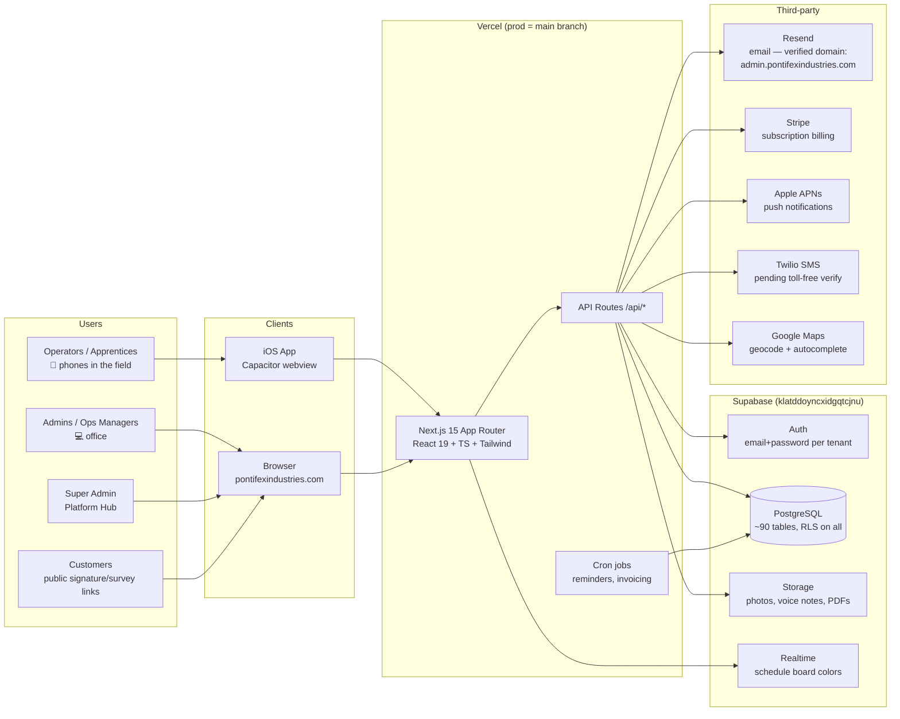
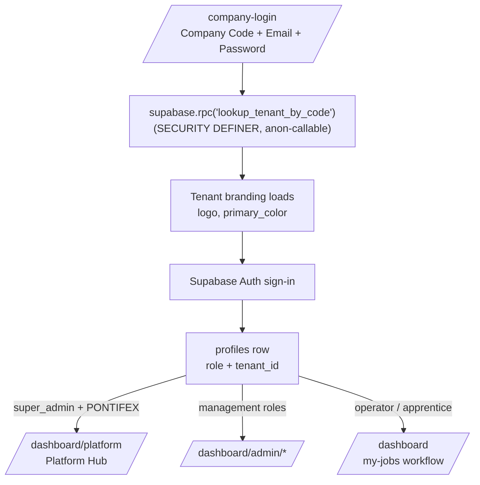
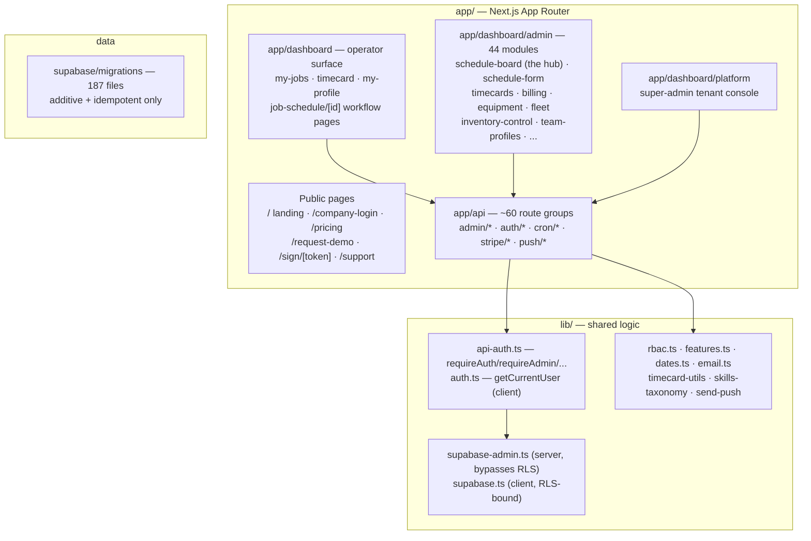
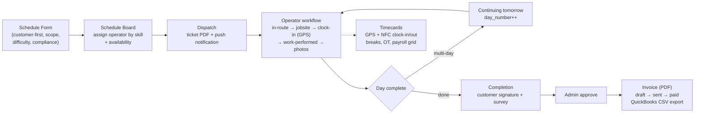
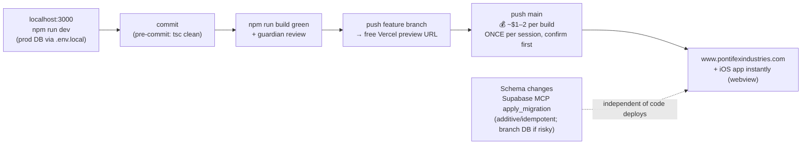

# Pontifex Industries — Platform Architecture

> The single source of truth for how the system is built. Diagrams are Mermaid — they render
> visually on GitHub and in most editors (VS Code: install "Markdown Preview Mermaid Support").
>
> Last reviewed: Jun 9, 2026

## 1. What this is

**Pontifex Industries** is a multi-tenant SaaS platform for concrete-cutting / construction-services
companies. It runs the full operations lifecycle: schedule jobs → dispatch operators → track field
work (GPS clock-in, work performed, photos, signatures) → timecards/payroll → invoicing → equipment
& shop management.

- **Tenant #1 (paying trial):** Patriot Concrete Cutting (`PATRIOT`)
- **Owner org:** Pontifex (`PONTIFEX`) — super_admin lands on the Platform Hub
- **Production:** https://www.pontifexindustries.com (Vercel, branch `main`)
- **iOS:** Capacitor wrapper on the App Store (v1.0.2 live; v1.0.3 Face ID in TestFlight) — a native
  webview that loads the production URL, so **web deploys update the app instantly**

## 2. System context (the 30,000-ft view)

## 3. Multi-tenancy & auth model

**Tenants:** every business table carries `tenant_id`; RLS enforces isolation on all ~90 tables.
- `PONTIFEX` = owner org `b27d9ca5-1352-42f2-b7e1-25254c09fa6f`
- `PATRIOT` = client tenant `ee3d8081-cec2-47f3-ac23-bdc0bb2d142d`

**Roles (rank order):** `super_admin > operations_manager > admin > salesman > shop_manager > inventory_manager > operator > apprentice` (+ `shop_help`, `supervisor`). RBAC dashboard cards live in `lib/rbac.ts` (`ADMIN_CARDS` + `ROLE_PERMISSION_PRESETS`).

**🔒 RLS non-negotiables** (enforced by guardian review on every migration):
- **NEVER** `auth.jwt() -> 'user_metadata'` in a policy (client-writable → privilege escalation)
- Use the SECURITY DEFINER helpers reading `public.profiles`: `public.is_admin()`,
  `public.current_user_role()`, `public.current_user_tenant_id()`, `public.current_user_has_role(...)`
- Every new table: `tenant_id` column + tenant-scoped policy + idempotent DDL

## 4. Code layout (what lives where)

**Key conventions** (full list in `CLAUDE.md`):
- API routes: `requireAuth()` / `requireAdmin()` / `requireSuperAdmin()` from `lib/api-auth.ts`;
  response shape `{ success: true, data }` or `{ error }` + HTTP status
- Server DB access via `supabaseAdmin` (service role); client via `lib/supabase.ts`
- Fire-and-forget logging: `Promise.resolve(...insert...).then().catch(() => {})`
- **Dates:** `lib/dates.ts` only — never `new Date('YYYY-MM-DD')` (UTC off-by-one bug class)
- Email: `lib/email.ts` — `DEFAULT_EMAIL_FROM` / `getResendApiKey()` only; never raw env reads
- Module gating: `tenants.features` jsonb → `lib/features.ts` `isModuleEnabled()` → sidebar +
  `<ModuleGuard>` per page (default-ON, fail-open)

## 5. The core business flow (job lifecycle)

## 6. Deployment pipeline & cost discipline

- **One Supabase project** serves prod + local dev — migrations hit live data; be additive.
- iOS releases are only needed for **native** changes (icon, plugins, Info.plist) — see
  `.claude/skills/ios-release/SKILL.md`. Web fixes never need App Store review.

## 7. Where things are going (productization roadmap)

1. **Patriot = the proven base.** Every feature ships tenant-generic (branding via `BrandingProvider`).
2. **Module switchboard** (`tenants.features`) — per-tenant feature packages; UI + page gating live,
   API-level gating is the next phase (`lib/require-module.ts`, currently unused/fail-open).
3. **Platform Console** (`/dashboard/platform`) — super-admin creates/manages client tenants.
4. **New client onboarding** = `scripts/new-tenant.ts` + branding + module selection (no code changes).
5. **Android** after iOS stabilizes (`npx cap add android`).

## 8. Document map

| Doc | Purpose |
|---|---|
| `README.md` | Front door — quick start, links |
| `ARCHITECTURE.md` | This file — system design + diagrams |
| `BACKLOG.md` | **Single source of truth** for bugs/features/priorities |
| `CLAUDE.md` | AI engineering conventions + guardrails |
| `CLAUDE_HANDOFF.md` | Session-to-session handoff (newest at top) |
| `DEPLOYMENT_COST.md` | Vercel cost rules — read before pushing |
| `APP_CHANGES.md` | Native iOS-only change log |
| `docs/DEVELOPMENT_PLAYBOOK.md` | How we build (executive-engineer + guardian pattern) |
| `docs/TOOLING_EVALUATION.md` | Third-party tool/repo adoption decisions |
| `docs/plans/` | Forward-looking feature plans |
| `docs/playbooks/` | Repeatable how-tos (App Store, email, setup) |
| `docs/reference/` | Deep context (schema patterns, feature catalog, scaling) |
| `docs/archive/` | Historical reports — don't update, don't delete |
