# Development Playbook — how we build

> The repeatable operating system for this project. The founder directs; Claude acts as the
> **executive engineer** (analyze → architect → dispatch → verify → ship). Humans and AI both
> follow this document.

## The session loop

```mermaid
flowchart LR
    A["1. Orient<br/>read CLAUDE_HANDOFF.md<br/>+ BACKLOG.md"] --> B["2. Pick work<br/>top of backlog unless<br/>founder reprioritizes"]
    B --> C["3. Plan<br/>write/refresh a plan doc<br/>for anything > 1 day"]
    C --> D["4. Build<br/>parallel subagents by layer<br/>(backend → UI → wiring)"]
    D --> E["5. Guardian review<br/>independent reviewer agent<br/>on EVERY builder's diff"]
    E -->|blocking findings| D
    E -->|pass| F["6. Verify<br/>tsc clean · build green<br/>· jest pass · live check"]
    F --> G["7. Commit<br/>logical chunks,<br/>descriptive messages"]
    G --> H["8. Ship<br/>ONE push per session,<br/>founder confirms"]
    H --> I["9. Close<br/>update BACKLOG.md +<br/>CLAUDE_HANDOFF.md"]
```



## Roles (the "team" until humans join)

| Role | Who | Responsibility |
|---|---|---|
| **Founder / Product** | Andres | Priorities, founder-only actions (env vars, App Store clicks, payments), final ship call |
| **Executive engineer** | Claude (main session) | Analysis, architecture, dispatching, integration, verification, docs |
| **Builders** | `backend-dev`, `coder` subagents | One layer each (API/DB vs UI), disjoint files or worktree-isolated |
| **Guardian** | `reviewer` subagent | Adversarial review of every builder diff — see checklist below |
| **Specialists** | `mobile-responsive-auditor`, `rls-policy-auditor`, `supabase-migration-author` | Triggered by their domain |

### Guardian checklist (what the reviewer must check, every time)

1. **Tenant isolation** — every query/policy scoped by `tenant_id`; cross-tenant writes take an explicit target
2. **No `auth.jwt() -> 'user_metadata'`** anywhere in authz
3. **Migrations additive + idempotent** (`IF NOT EXISTS`, `EXCEPTION WHEN duplicate_object`)
4. **React hook order** — no conditional hooks; guards return after hooks
5. **Web/SSR safety** — no `window` at module scope; native-plugin calls behind `isNativeApp()`
6. **Mobile** — ≥44px tap targets, no horizontal overflow at 375px, 16px input font floor
7. **Dates via `lib/dates.ts`**; email via `lib/email.ts`
8. **Error paths** — API failures surface to the user; fire-and-forget only for logging

## Verification gate (before ANY push to main)

```bash
# stop dev server first (shares .next)
rm -rf .next
npm run build          # green, no "Failed to compile"
npx tsc --noEmit       # exit 0 (also enforced by pre-commit hook)
npx jest               # all pass
```
Then: feature branch → Vercel preview URL → eyeball it → founder confirms → push main **once**.

## Cost discipline (why we batch)

- Each push to `main` = ~$1–2 billed Vercel build. Commits are free. **Batch, push once per session.**
- Docs-only changes: commit, never push alone — ride along with the next code push.
- Schema changes deploy via Supabase MCP independent of code pushes (free).

## Parallel work rules

- Batch by **layer** (all backend → all UI), not by feature.
- Same-file collisions → worktree isolation; **merge worktrees back before session end** and
  **clean up `.claude/worktrees/`** (they once hit 81 GB).
- Worktrees don't inherit `.env.local` — copy it or Supabase calls fail.

## Definition of Done

A feature is done when: builder built it → guardian passed it → build/tsc/jest green → verified
live (preview or prod) → BACKLOG.md updated → handoff updated. Not before.

## Progress tracking (how any conversation knows where we are)

**Principle: progress lives in the REPO, never in a chat's memory.** Any conversation — today's,
next week's, a fresh one after a crash — reads the same three artifacts and knows exactly where we are:

| Artifact | Question it answers | Updated |
|---|---|---|
| `BACKLOG.md` → **📊 STATUS table** | "Where are we right now?" — phase, prod/iOS state, open counts by priority, what's in flight, what's blocked on the founder, unpushed commits | Every session (start + end) |
| `BACKLOG.md` → P0–P3 lists | "What's next and what's done?" | The moment an item changes state |
| `CLAUDE_HANDOFF.md` top section | "What happened last session, in detail?" | End of every session |

**The session ritual (Claude does this automatically):**
1. **Session start** — read handoff + BACKLOG → post a short **status report** in chat: ✅ shipped
   since last time · 🔄 in flight · 🔴 blocked on founder · 🎯 today's plan. The founder should
   never have to ask "where are we?"
2. **During** — completed items get checked off in BACKLOG.md *as they finish*, not at the end.
   New issues discovered mid-work go straight into BACKLOG.md with a priority.
3. **Session end** — refresh the 📊 STATUS table, move shipped items to "Recently shipped",
   update the handoff. The next conversation inherits everything.

**Founder's view:** open `BACKLOG.md` on GitHub anytime — the STATUS table is the dashboard;
`ARCHITECTURE.md` is the map. Or just ask "where are we?" in any conversation.

## Skills (executable playbooks)

Repeatable multi-step procedures live as project skills in `.claude/skills/` so any session can
run them without re-deriving:

- `ios-release` — version bump → archive → export → Transporter → App Store Connect
- `prod-deploy` — the full verification gate + push + deploy-watch sequence
- `guardian-review` — the adversarial review checklist as an invocable procedure
