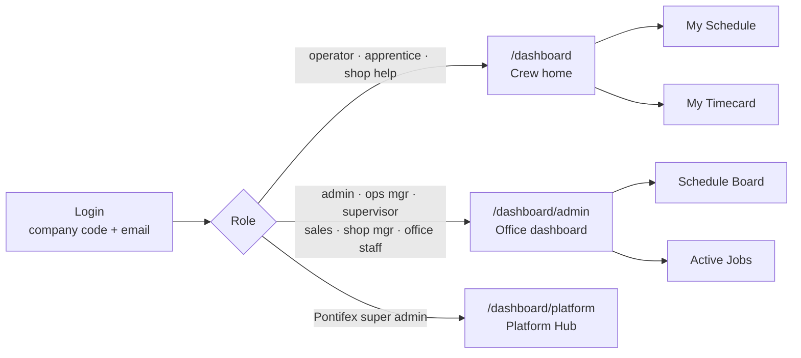
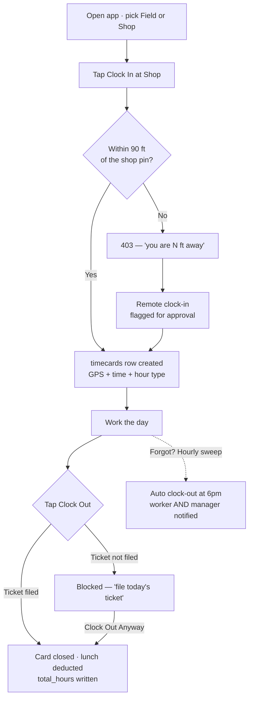
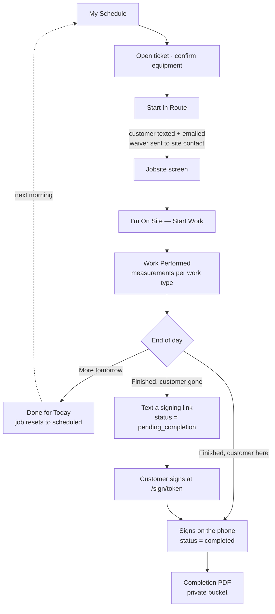
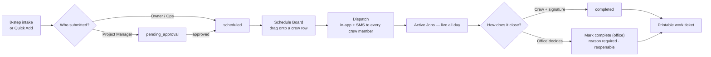
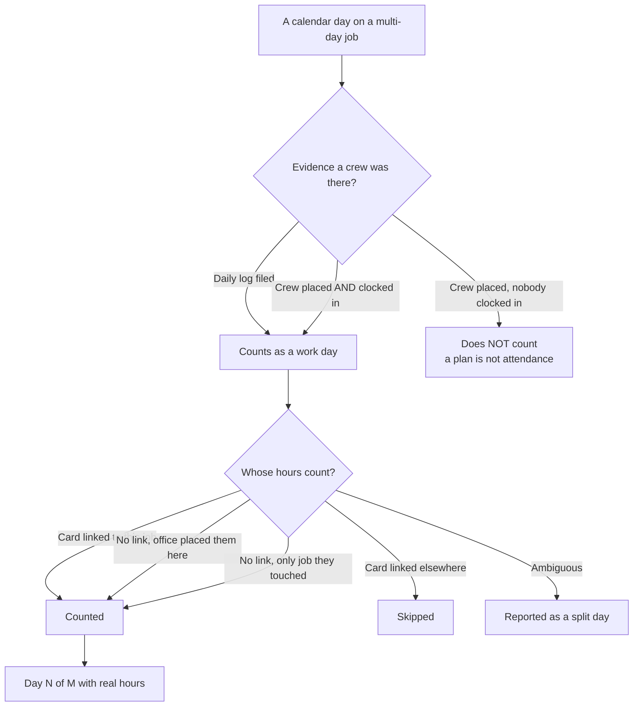
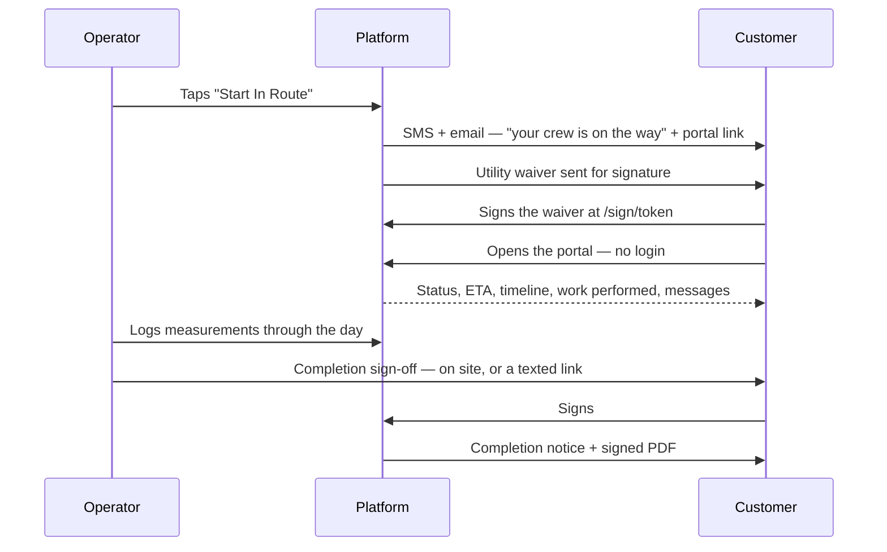
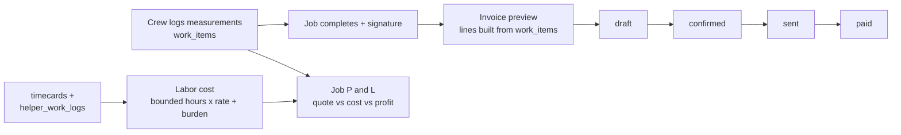

# Platform Walkthrough — presentation reference

**Written:** Aug 14, 2026 · **Verified against:** `main` @ `148e5880` (all commits pushed and live)
**Purpose:** hand this to Claude Design to build a presentation. Every route, status name, and rule
below was read out of the codebase today, and several were checked against live production data.

**Read this first.** There is a section at the end called **[Do not demo](#6-do-not-demo)**. It
lists screens that look finished and are not. Some of them will 404, one shows fabricated sample
data, and two would put placeholder legal text in front of a room. Read it before building a
single slide. Everywhere else, a **Note:** line marks a caveat — leave those in. A claim that
collapses under a question is worse than an omission.

---

## Table of contents

1. [What this platform is](#1-what-this-platform-is)
2. [The cast — who opens the app, and why](#2-the-cast--who-opens-the-app-and-why)
3. [The five walkthroughs](#3-the-five-walkthroughs)
   - [3.1 Timecards — the clock](#31-timecards--the-clock)
   - [3.2 The operator ticket — a day on a jobsite](#32-the-operator-ticket--a-day-on-a-jobsite)
   - [3.3 The office — schedule, dispatch, live jobs, multi-day](#33-the-office--schedule-dispatch-live-jobs-multi-day)
   - [3.4 The customer — what the client sees](#34-the-customer--what-the-client-sees)
   - [3.5 Billing and labor — from footage to money](#35-billing-and-labor--from-footage-to-money)
4. [Live today vs next](#4-live-today-vs-next)
5. [Screenshot shot-list](#5-screenshot-shot-list)
6. [Do not demo](#6-do-not-demo)
7. [Appendix — where these facts came from](#7-appendix--where-these-facts-came-from)

---

## 1. What this platform is

Pontifex Industries is a platform company. We build the digital infrastructure that field-service
and construction businesses run on — the scheduling, the clock, the field paperwork, the customer
record — as one system instead of six disconnected tools. The platform is **multi-tenant** and
**white-label**: every company that comes on gets its own isolated data, its own logo, its own
colors, and its own login code, and none of them can see each other. Nothing in the product is
hard-coded to any one industry. **Patriot Concrete Cutting is tenant #1** — a real company whose
crew has been running its whole operating day on this platform since spring 2026. Patriot is the
proof, not the product.

Technically: Next.js 15 + React 19 + TypeScript on Vercel, PostgreSQL on Supabase with row-level
security enforcing tenant isolation *in the database*, and the same web app wrapped with Capacitor
for the iOS and Android stores. That last point matters commercially: **the phone apps load the
live site**, so a fix reaches every phone in the field the moment it deploys — no store review, no
"please update your app."

> **Positioning guardrail:** describe Pontifex as the bridge companies cross to get custom digital
> infrastructure. Do **not** describe it as concrete-cutting software. Concrete cutting is what
> tenant #1 does; it is an example, not the category.

---

## 2. The cast — who opens the app, and why

**Ten roles** ship today (`lib/rbac.ts` → `ROLES_WITH_LABELS`). The label in the second column is
what appears on screen; the first column is the internal name you will see in the database. **They
often differ, and that matters on stage** — a "salesman" is labelled Project Manager, an
"inventory_manager" is labelled Office Staff, an "apprentice" is labelled Team Member.

| Rank | Internal | On screen | What they open the app to do |
|---|---|---|---|
| 8 | `super_admin` | Owner / Super Admin | Everything. For Pontifex's own staff this is the Platform Hub — the console that manages customer companies. |
| 7 | `operations_manager` | Operations Manager | Runs the day. Same full access as the owner. Can also be dispatched onto a job. |
| 6 | `admin` | Admin | The office. Books jobs, works the board, reads timecards, owns customers and billing. |
| 5 | `supervisor` | Supervisor | Checks on crews, files site-visit reports and grades — **and can be dropped into a crew slot** and run the operator ticket himself. |
| 5 | `salesman` | **Project Manager** | Brings the work in. Submits jobs (which land in an approval queue), reads customer profiles, sends contracts, reads employee review history. |
| 4 | `shop_manager` | Shop Manager | Owns the equipment and the trucks. Pulls gear for tomorrow, triages maintenance, runs shop tasks. Sees active jobs specifically to know *where* crews are for drop-offs. |
| 3 | `inventory_manager` | **Office Staff** | Read-only clerk: schedule, timecards, customers, billing. Looks, never writes. |
| 2 | `operator` | Operator | Does the work. Zero admin screens by design — lives entirely in the field app. |
| 2 | `shop_help` | Shop Helper | Permanent shop hand: clocks in, pre-use checks, delegated shop tasks. |
| 1 | `apprentice` | **Team Member** | Field helper. Works alongside an operator, files a helper log — and can be put in the operator seat when he is leading a job. |

**Two things worth saying out loud in the room:**

1. **Role is not seat.** Whether someone runs the operator ticket is decided by whether the office
   *put them in a crew slot on that job*, not by their title. `CREW_SLOT_ROLES` in `lib/rbac.ts`
   is `operator, apprentice, supervisor, operations_manager, super_admin`. An apprentice leading a
   job gets the full operator ticket. A supervisor sent out on a scanning job gets it too.
2. **The app you land in depends on who you are.** `/dashboard` is the crew home. The eight
   office/management roles are redirected to `/dashboard/admin`. A Pontifex-org super admin lands
   on `/dashboard/platform` (`app/dashboard/page.tsx:116-140`).

---

## 3. The five walkthroughs

### 3.1 Timecards — the clock

**One sentence:** you can only start your day standing at the shop, the system proves it with GPS,
and if you forget to clock out it closes your card for you and tells your manager.

#### What the human actually taps

1. Opens the app, lands on the crew home (`/dashboard`).
2. Picks **Field** or **Shop** — a two-button toggle that only appears when not yet clocked in.
3. Taps **Clock In at Shop**. The phone asks for location; the tap sends the GPS reading up.
4. The server measures the distance to the shop pin. **Inside 90 feet → clocked in. Outside → a
   403 telling them how far off they are.** This cannot be faked from the phone; the check is
   server-side (`app/api/timecard/clock-in/route.ts:258`).
5. Genuinely out of town? They switch to the **Remote** tab, tick "I confirm I'm working
   remotely," and submit. That card is flagged `requires_approval` and goes to the office queue.
6. They work. Nothing to tap. **There is no lunch button** — see the note below.
7. End of day: **Clock Out**. Before it goes through, the app checks whether they filed today's job
   ticket. If not, it blocks and offers a deliberate **Clock Out Anyway** escape.
8. If they were out of town, it asks whether they stayed overnight — that drives per-diem.

> **Note — lunch is automatic, not a button.** Nobody punches out for lunch. At clock-out the
> server deducts a lunch if the day ran over 6 hours: **60 minutes for shop roles, 30 for field
> roles**, overridable per person and per company. The deduction is stored on the card so the PDF
> can show "9.82 gross − 30m lunch." If asked "can they punch out for lunch?" the honest answer is
> *not today — it is deducted by rule instead.*

> **Note — GPS is required to clock IN, not to clock OUT.** An out-of-radius clock-out is not
> blocked. It is recorded, the office is notified, and the system **automatically opens a
> correction request** so a human reviews it. Clock-out radius is 100 ft; clock-in is 90 ft. Both
> are per-company settings with those as defaults.

> **Note — PIN and NFC badge clock-in were retired in June 2026.** GPS only. Some server plumbing
> for the old methods survives but no screen sends it.

#### The diagram

#### Routes to screenshot

| Route | Who sees it | What it is |
|---|---|---|
| `/dashboard` | operator, apprentice, shop_help | Crew home. Field/Shop toggle + clock card. |
| `/dashboard/timecard` | any employee | Their own timecard: live hours, week grid, breakdown, PDF. |
| `/dashboard/admin/timecards` | office | Everyone × Mon–Sun grid, approvals, export. |
| `/dashboard/admin/timecards/late` | office | Every late arrival in a week, with minutes. |
| `/dashboard/admin/timecards/corrections` | office | The correction queue — requested edits *and* auto-flagged out-of-radius clock-outs. |
| `/dashboard/admin/timecards/operator/[id]` | office | One person's week with GPS pins and lunch math. |
| `/dashboard/admin/timecards/operator/[id]/report` | office | The annual employee report. |
| `/dashboard/admin/settings/timecard` | office | Lunch rules, auto clock-out time, reminder anchors. |

#### What gets written

| Step | Table | Key columns |
|---|---|---|
| Clock in | `timecards` (insert) | `user_id, tenant_id, clock_in_time, clock_in_latitude/longitude/accuracy, date, work_location, is_shop_hours, is_night_shift, hour_type, clock_in_method, job_order_id` |
| Late arrival | `timecards` update + `schedule_notifications` | `is_late, late_minutes, scheduled_start_time` + a notice to every manager |
| Clock out | `timecards` update | `clock_out_time`, GPS, `total_hours` (net of lunch), `break_minutes`, `lunch_duration_minutes`, `auto_lunch_applied`, `clock_out_outside_radius` |
| Auto clock-out | `timecards` update + 2 × `schedule_notifications` | `auto_closed: true`, `notes: 'Auto-closed: forgot to clock out'` |
| Helper's day | `helper_work_logs` | `helper_id, job_order_id, log_date, started_at, completed_at, hours_worked, is_shop_ticket` |
| Correction | `timecard_correction_requests` | `timecard_id, requested_clock_in/out, reason, status` → office approves, modifies, or rejects |

**Hour type is classified at clock-in:** Saturday or Sunday → `mandatory_overtime`; a weekday start
at or after 3pm and not shop work → `night_shift`; otherwise `regular`. Weekly overtime is weekday
hours over 40, with holiday and double-time hours paid but exempt from the 40-hour calculation
(`lib/timecard-utils.ts` → `calculateWeekSummary`).

#### The reminders — and exactly when they fire

Fourteen scheduled jobs run the platform's background work. These are the ones a person feels:

| Reminder | Runs | Who gets it | Suppressed when |
|---|---|---|---|
| **Clock-in nudge** | ~5 min *before* and ~5 min *after* the company's start anchor (Patriot: 7:00 → so ~6:55 and ~7:05) | anyone scheduled on a job today who has not clocked in | approved time off · already clocked in · company turned it off |
| **Clock-out nudges** | at **10h**, **12h**, **15h** on the clock — only the highest crossed fires, so a missed tick sends one message, not a burst | the person still clocked in | already clocked out; deduped once per shift |
| **Personal clock-out time** | a fixed hour set per person (`profiles.clock_out_reminder_time`) | Patriot uses this for one supervisor at 6:30pm | — |
| **"You're about to be auto-clocked-out"** | 30 min before the company's auto clock-out time | day-shift cards | night shifts excluded |
| **Smart "you're done" nudge** | ~30 min after their last ticket is filed, **delayed up to 2h based on drive distance back to the shop** so it lands when they arrive, not mid-drive | crew who finished everything and are still on the clock | they had no field tickets that day (a shop day) |
| **Manager escalation** | after that nudge goes unanswered | management, once per worker per shift | — |
| **Missing-ticket chase** *(new, Aug 14)* | ~7:15 the next morning | the crew lead who worked a day and never filed a ticket — deep-linked to **that date**, not today | only open jobs are chased; each missed day asked about once |
| **Auto clock-out** | hourly; closes the card at the company's set time (default 6pm; noon for night shift) | never touches a card under 4 hours old | disabled per company |

> **The line worth saying in the room:** the first live run of the missing-ticket chase found
> **seven unsubmitted tickets in one week across four people** — days of real work that nobody,
> including the crew, knew were missing. That is what this class of software is actually for.

> **Note on channels:** every reminder always lands in the in-app bell. Push is **on by default**;
> **SMS is off by default** and each employee opts in. Clock-out reminders currently share the
> clock-in preference setting, so an employee cannot mute one without the other.

#### How an employee sees their own hours

`/dashboard/timecard` is their page: a live running-hours counter while clocked in, a week
navigator, a color-coded day grid, the week total against a 40-hour bar, a breakdown by category
(Regular · Weekly OT · Night Shift · Shop Hours · Mandatory OT), every entry with its clock times,
their PTO balance, and a **Download PDF** button producing a company-branded weekly timecard with
signature lines. Any entry has a pencil that opens a correction request.

> **Note:** the employee's own screen recomputes the 40-hour split inline and omits the holiday /
> double-time carve-outs the PDF and the office screens apply. On a week containing a holiday the
> two can disagree. Known, logged.

---

### 3.2 The operator ticket — a day on a jobsite

**One sentence:** the crew's whole day is one guided flow on a phone — drive, arrive, get the
utility waiver signed, record every cut with real measurements, and finish either "back tomorrow"
or "done, sign here."

#### What the human actually taps

1. **`/dashboard/my-jobs`** — "My Schedule." Only their jobs, for one day at a time. The date
   stepper goes 14 days back and **is hard-clamped at today** — a crew member cannot browse
   forward into work that has not been dispatched. Above it sit two rescue lists: **Multi-Day In
   Progress** ("Up next: Day 4") and **Continuing Projects**.
2. Taps a job → **`/dashboard/my-jobs/[id]`** — the ticket: customer, site contact, scope, notes,
   and the **equipment checklist**, which must be confirmed before the next button unlocks (until
   then it reads *"Complete Required Equipment First"*).
3. Taps **Start In Route** (or **Start Day N In Route** on a multi-day job). Status → `in_route`.
   **This is the moment two things fire at once:** the customer is texted and emailed that the crew
   is on the way with a link to their portal, *and* the utility waiver is sent to the site contact
   for signature.
4. Drives. Lands on **`/dashboard/my-jobs/[id]/jobsite`** — address with directions, site contact
   and phone, jobsite conditions, site compliance rules (e.g. photos prohibited), extra notes.
5. Taps **"I'm On Site — Start Work."** Status → `in_progress`; `work_started_at` and
   `arrived_at_jobsite_at` are stamped **here**.
6. **Work performed** (`/dashboard/job-schedule/[id]/work-performed`) — pick the work type from a
   catalog of eight categories, then enter the real measurements.
7. End of day, **`/dashboard/job-schedule/[id]/day-complete`**, three buttons:
   - **Done for Today** → files the day's log, and **resets the job to `scheduled`** with the
     route/work timestamps cleared so tomorrow starts clean.
   - **Complete Job — Get Signature On Site** → customer signs on the operator's phone. Status →
     `completed`. Requires at least one photo unless the site prohibits photography.
   - **Send Completion Link & Finish Job** → texts a signing link. Status → `pending_completion`
     until the customer actually signs.

> **Note — there is no separate "Arrived" tap.** `on_site` exists as a status in the code but no
> screen sets it; the operator flow goes `in_route → in_progress`, and arrival is stamped from the
> "I'm On Site" tap. Say "arrived" in the narration, not "there is an Arrived button."

> **Note — arrival used to be wrong, and was fixed on Aug 10.** The jobsite screen used to stamp
> arrival the instant it loaded — about two seconds after "In Route" — so *every job in the
> database* recorded arrival while the crew was still at the shop, and the customer's portal said
> "on site" while the text said "on the way." One contractor texted asking whether anyone was
> coming. Arrival is now an explicit operator tap. Deriving it from GPS is the next step. This is
> a good story to tell if anyone asks how you find bugs like that: a customer complaint, traced
> back through fifteen jobs of data.

#### The diagram

#### The status pipeline

`pending_approval` → `scheduled` → `assigned` → `in_route` → `on_site` → `in_progress` →
`pending_completion` → `completed`. (`on_hold`, `cancelled` and `archived` are side-states.)
Transitions are **legal-move-checked and forward-only** — a stale phone cannot drag a job
backwards. Each transition stamps its own column on `job_orders`: `in_route_at`,
`arrived_at_jobsite_at`, `work_started_at`, `work_completed_at`.

#### What "work performed" actually captures

Eight categories carrying the real vocabulary of the trade: **Core Drilling** · **Sawing** (slab,
electric slab, wall, wire, hand, flush-cut hand, chain, ring, push) · **Breaking & Removal**
(break & remove, demolition, removal, excavate dirt, Brokk) · **Concrete Work** · **Installation**
(bollards, lintels, manhole boot, joint sealing) · **Equipment & Tools** · **Services** (image
scan, safety meetings, standby time, travel/trip charge, hauling, disposal) · **Materials**.

The form changes with the work:

- **Coring** — a repeatable list of holes: bit size, depth in inches, quantity, plastic setup, and
  rebar size. The item's quantity is the sum of the holes.
- **Sawing** — each cut is entered either as **linear feet × cut depth**, or as an **area (length ×
  width × depth)**, in which case the billable linear feet are computed as the **perimeter**
  (2L + 2W) × quantity — because they bill linear feet of cut, not square feet. Each cut also
  records the blades used, overcut, and **whether rebar or steel was hit** — the thing that turns a
  routine cut into a change-order conversation.
- **Breaking / demolition / jackhammering / Brokk** — areas as length × width × depth, totalled in
  square feet, plus how the material left the site.
- **Everything else** — a plain "how much did you do?" amount and unit (each, sq ft, linear ft,
  holes, loads, hours, lbs, yards).

Every item can carry photos, a difficulty rating, and **Quick Notes** — with a voice-memo button,
because an operator in gloves is not going to type. Each entry becomes a row in **`work_items`**,
tagged with the job and the day number. Those rows are the single source of truth for three
different things downstream: the customer's ticket, the progress percentage the office sees, and
the invoice.

> **Quick Notes are internal, and that is enforced, not promised.** The field tells the operator
> his notes stay in the office and never reach the customer. On Aug 14 we found the on-screen
> signing sheet was displaying them (the PDF was already clean) and closed it. Today no
> customer-facing surface — portal, signing page, or PDF — selects the notes column at all. This
> is a good slide if the audience cares about what field staff can safely write down.

#### Routes to screenshot

| Route | Who | What |
|---|---|---|
| `/dashboard/my-jobs` | crew | My Schedule — today's jobs, clamped to today. |
| `/dashboard/my-jobs/[id]` | crew | The ticket: scope, contact, equipment checklist. |
| `/dashboard/my-jobs/[id]/jobsite` | crew | Jobsite screen — conditions and compliance. |
| `/dashboard/job-schedule/[id]/utility-waiver` | crew (customer signs) | Waiver + signature pad on the operator's phone. |
| `/dashboard/job-schedule/[id]/work-performed` | crew | Work-type catalog and measurement entry. |
| `/dashboard/job-schedule/[id]/day-complete` | crew | The three-way fork and the signature. |

---

### 3.3 The office — schedule, dispatch, live jobs, multi-day

#### The day from the office chair

1. **Work comes in** through an **8-step intake wizard**
   (`/dashboard/admin/schedule-form`): customer & PO → project and site contact (with address
   autocomplete) → scope of work from 13 service codes → difficulty & notes → equipment and PPE →
   scheduling → site compliance (badging, permits, whether a waiver and a completion signature are
   required) → jobsite conditions (water, power, ventilation, access, scaffolding). For a phone
   call that needs a job number now, **Quick Add** on the board captures six fields and explicitly
   records what is still missing.
2. **An approval gate exists.** A Project Manager's submission lands as `pending_approval`; an
   owner's or operations manager's goes straight to `scheduled`.
3. **Work that isn't ready parks.** `/dashboard/admin/pending-jobs` holds **parked** jobs — the
   office put them on hold, or the crew filed a "site not ready" report from the field, complete
   with the reason, site photos and who reported it. One button pushes the ticket back onto the
   board.
4. **Will Call** is a **waiting list for an earlier slot** — the job keeps its date, and the
   customer would take a sooner one if it opened. The board has a Will Call folder for exactly
   this.
5. **The Schedule Board** (`/dashboard/admin/schedule-board`) is the center of the business. Day
   or week; and within the day, three lenses — numbered **crew rows** (an operator slot and a
   helper slot each), **operator rows**, or a **crew grid** (operator × date). Jobs are dragged
   between rows. Below sit the **Unassigned** section, the **Will Call folder**, and a shared
   daily notes panel.
6. **Dispatch.** "Push Tickets" for the date sends the day to the crews' phones. It can also run
   automatically at **7:05am** for companies that turn that on.
7. **Watch it happen** on `/dashboard/admin/active-jobs`.
8. **Close it out** — the crew with a signature, or the office itself.

#### What dispatch actually does

One atomic database claim stamps `dispatched_at` and moves the job to `assigned` — and
notifications fire off *the rows that actually changed*, never off a prior read. If a human presses
Push at the same instant the 7:05 cron runs, exactly one of them wins and the crew is texted once.

Recipients are the lead, the helper, **and every extra crew member** — because a three-person crew
otherwise only ever hears from dispatch twice. Each gets an in-app notification and an SMS with the
job number, customer, location, arrival time and their role on the crew.

> **Note:** dispatch sends **in-app + SMS**. It does not send push or email. Worth being precise
> about if someone asks.

#### What a live job card shows

On `/dashboard/admin/active-jobs`: a **status badge**, the job number, customer and address, the
**assigned operator** and — if the office swapped crew for the day — a violet pill reading
**"today: {name}"**, badges for pending change requests / awaiting approval / notes, a **progress
percentage**, and a collapsible **"Daily work"** panel listing, per day, exactly what was cut. The
board polls every 2 minutes and **pauses when the tab is hidden**.

Progress is not a field anyone types. It is **derived from the `work_items` the crew logged**,
reconciled against the scope the office quoted (`lib/job-progress.ts`). That reconciliation is the
interesting part: the office scopes "Wall/Track Sawing," the crew logs "WALL SAW," and a third
screen says `wall_sawing`. All three are mapped to one work family. Before that existed, every job
read 0% while operators had logged real work.

> **Note:** time on site, clock times and hours live on the **job detail page**
> (`/dashboard/admin/jobs/[id]`), not on the Active Jobs card. The detail page's live panel also
> shows the operator's **unsubmitted draft** of work performed — the office can watch the numbers
> arrive before the ticket is filed.

#### How a multi-day job reads — the important one

Slow down here. This is the difference between software that looks right and software that is
right, and it is the newest work in the deck.

**A day number is a calendar position, not a tap count.** Until Aug 14 the system numbered a job's
days by counting how many times somebody had pressed "day complete." An operator who worked
Wednesday and Thursday but only filed paperwork on Thursday produced *one* day, labelled Day 1,
dated Thursday. Wednesday did not move — it was never counted. Every screen downstream inherited
the hole: the printed ticket, the daily progress panel, the invoice breakdown.

Now a day counts when the job can **prove** a crew was on it:

| Evidence | Counts? |
|---|---|
| A daily log was filed for that date | ✅ Yes |
| The office placed a named crew that day **and that person clocked in** | ✅ Yes |
| The office placed a crew and **nobody clocked in** | ❌ No |

That last line is the whole design. **A plan is not attendance; the clock is.** One operator was on
the board for a Saturday and Sunday he never worked — counting the placement alone would have moved
his Monday from Day 4 to Day 7 and printed two weekend days he never worked onto a customer's
ticket.

**Where each day's hours come from: the clock.** Not the job, and not whether anyone tapped
anything. A clock card is *one person's day* — it is not a job record, and no inference makes it
one. It counts against a job in exactly three provable cases:

1. the card is explicitly linked to this job, **or**
2. the card has no link and **the office placed that person on this job, and only this job, that
   day**, **or**
3. no link and no placement, but that person touched only this one job that day.

A card linked to a *different* job is skipped outright. Anything else is unknowable, so the day is
reported as a **split day** rather than as a number that looks measured and isn't.

Before that rule, one production job displayed **666 hours against 565 real hours — 101 invented
hours, 17.9%** — because the same card was being counted against three jobs at once. After: 54
attributions of 54 distinct cards, zero double counting.

The job carries `is_multi_day` and `total_days_worked` (the **M**); each daily log carries
`day_number` (the **N**). Both are computed by database triggers from the same evidence view, so a
ticket can never read "Day 2 of 1."

> **Where this is visible today:** the **printed work ticket** uses the full attribution rule
> including the split-day flag. The Daily Progress panel on the job page renders the filed daily
> logs with their corrected day numbers and hours. A richer per-day API exists with the provenance
> flag exposed but is not yet wired to a screen — don't promise a "split day" label in the UI.

> **Note:** the crew grid still buckets a multi-day job only on its start date, so it can show a
> busy operator as free later in the span. Known, logged, not yet fixed. Don't demo the crew grid
> against a long multi-day job.

#### What changes when a job completes

- **The crew closes it** — the customer signs, status → `completed`, `work_completed_at` stamped,
  signature stored, a completion PDF generated into a private bucket, and the customer emailed and
  texted that the job is done.
- **The office closes it** — new on Aug 14, and a good story. Some jobs exist only so a project
  manager could print a ticket; nobody is ever assigned and the work finishes outside the system.
  **Mark complete (office)** requires a written reason, writes an audit row, and has a **Reopen**.
  It closes the *office* side only: no signature is forged on the operator's behalf, the job stays
  on the days he actually worked, and **a crew member halfway through entering the day's footage
  keeps writing** rather than losing it. The backend for this had existed since early August with
  unit-tested rules and nothing in the app calling it — a finished feature with no button.
- Completed work then lives at `/dashboard/admin/completed-jobs` (the full record: P&L, labor,
  signed documents) and `/dashboard/admin/completed-job-tickets/[id]` (the filing view).

#### The printed work ticket — worth a slide of its own

`/dashboard/admin/jobs/[id]/work-ticket` is the digital replacement for the carbon-copy field
ticket, with a **Day / Week toggle**. It deliberately mixes filled and blank: what the system
*knows* prints filled — customer, address, job number, dates, clock times, lunch, totals, work
performed with measurements, footage, the captured signature. What the crew writes **in the field**
stays a ruled blank line — paper ticket number, standby initials, temp labor, disposal loads,
slurry barrels, wet-ink signatures. That restraint is the point: it does not pretend to know things
it cannot know.

#### Routes to screenshot

| Route | Who | What |
|---|---|---|
| `/dashboard/admin` | office | The dashboard, assembled from what this role may see. |
| `/dashboard/admin/schedule-form` | office, sales | The 8-step intake wizard. |
| `/dashboard/admin/pending-jobs` | office | Parked jobs with the crew's not-ready reason and photos. |
| `/dashboard/admin/schedule-board` | office | The board — crew rows, Unassigned, Will Call. |
| `/dashboard/admin/active-jobs` | office | Live cards: status, today's crew, progress, daily work. |
| `/dashboard/admin/jobs/[id]` | office | One job in full: crew, clock-ins, Daily Progress, documents, Mark complete. |
| `/dashboard/admin/jobs/[id]/work-ticket` | office | The printable field ticket, day or week. |
| `/dashboard/admin/completed-jobs` | office | The archive with P&L and signed documents. |
| `/dashboard/admin/ops-hub` | ops / owner | Platform health: endpoint health, error log, diagnostics. |
| `/dashboard/command-center` | office / management | The live operations HUD. |
| `/dashboard/platform` | Pontifex super admin | The multi-tenant console — the SaaS story. |

---

### 3.4 The customer — what the client sees

**One sentence:** the customer never installs anything and never makes an account — they get a
link, and that link is a live window into their own job.

#### What happens, from their side

1. **The crew leaves the shop.** The operator taps *Start In Route*. The site contact receives a
   **text** — *"{Company}: Hi {name}, your crew is on the way for {job number}. Track your job:
   {link}"* — and the customer email address receives a branded email. Exactly one text is sent per
   job, guaranteed by an atomic claim on the transition.
2. **They tap the link** → `/portal/[token]`. No login, no password. The token is 32 random bytes
   generated by the database, valid **30 days**, and the same job keeps the same stable link.
3. **The portal landing page** shows the company's own logo and name, a greeting, how long the link
   is good for, an **Action Required** card if something is waiting to be signed, and **their job
   history** — every job this contact has with the company, each with a status *word* rather than a
   price: "Crew on the way," "Crew on site," "Scope complete."
4. **They open a job** → `/portal/[token]/job/[jobId]`:
   - job summary and **scope of work**, with an explicit rule in the code that no price is ever
     included,
   - an **estimated arrival** while the crew is en route, computed server-side from the shop and
     the jobsite,
   - a **five-step timeline** — Scheduled · On the Way · Arrived On Site · Work Started ·
     Completed — each lighting up from its real timestamp,
   - **Work Performed** — the measurements, from the same rows the crew entered,
   - **View Completion Report (PDF)** once the job is signed off, served by a one-hour signed URL,
   - a **Messages** thread they can write in, rate-limited, which emails and notifies the whole
     office.
5. **They sign what needs signing** — two different documents (below).
6. **The job closes** and they get a completion notice with the same link, so the record stays
   reachable.

#### The two documents, and who signs each

**Both are signed by the customer or site contact — never by the operator.** The operator's job is
to get the document in front of them.

| Document | When | How it reaches them |
|---|---|---|
| **Utility waiver** — the acknowledgement about what is buried in the slab, before cutting starts | fires automatically on the crew's **first In Route tap** | a texted/emailed link to `/sign/[token]`, or signed in person on the operator's phone. Re-sending reuses the same link so a text already in their phone keeps working. |
| **Completion sign-off** — confirms the work is done, plus a short satisfaction survey | at the end of the job | signed on the operator's phone on site, or a texted link if they have already left |

The remote waiver is the stronger instrument: full sectioned terms with the authorities cited, and
**three separate checkboxes** — safety acknowledgment, liability acceptance, cut-through
authorization — rather than one blanket "I agree," because a release is construed strictly against
whoever drafted it.

After the completion sign-off the customer answers a short survey (cleanliness, communication,
likelihood to use again, free-text), which rolls into the operator's running ratings.

> **Note — the waiver chase.** Sending the waiver used to be the whole feature; nothing ever
> checked whether it came back. Of every job that had gone In Route, exactly one had a signed
> waiver. There is now a reminder that chases **the operator and the helper** — not the customer —
> every 15 minutes in three escalating steps, keyed per person per job per day so a multi-day job
> doesn't burn all three on day one. The first message opens with item 1 of the paper ticket
> verbatim: *"Have contractor sign understandings prior to working and sign when complete."*

#### What the customer deliberately does NOT see

Good slide, because it is the difference between a portal and a leak. The portal returns an
explicit **whitelist of the 21 fields the page renders** — not a blacklist. Excluded: the job's
**total cost**, internal **quoting scope**, drive distance, total hours worked, internal IDs, and
the operator's **Quick Notes**.

> **Tell this honestly if the room is technical.** On Aug 13 our own review found the portal API
> was returning the entire job row — including `total_cost` — to an unauthenticated browser. None
> of it rendered on screen, which is exactly why it survived: it was visible only in developer
> tools. It was replaced with a whitelist the same day, deliberately not a blacklist, because a
> blacklist silently leaks the next column somebody adds. Found by our process, before a customer
> saw it.

> **Note — the portal is real and in daily use, and it is not the most polished screen in the
> product.** Tenant colors do not yet reach the landing page; the timeline is a fixed five-step
> timeline rather than start-and-projected-end dates; and day-by-day breakdown on a multi-day job
> is fetched but not yet rendered — the customer sees one aggregate Work Performed list. All on the
> backlog.

#### Routes to screenshot

| Route | Who | What |
|---|---|---|
| `/portal/[token]` | customer, no login | Landing: their contractor's branding, job history, action-required card. |
| `/portal/[token]/job/[jobId]` | customer, no login | Status, ETA, five-step timeline, work performed, messages. |
| `/sign/[token]` | customer, no login | The signing page — waiver or completion. **See §6 before showing the completion variant.** |
| `/dashboard/admin/customers/[id]` | office | The customer record behind all of it. |

---

### 3.5 Billing and labor — from footage to money

#### The chain

**What the crew measured becomes what the customer is billed.** There is no re-typing step, and
that is the design.

Invoice statuses, in order: **`draft` → `confirmed` → `sent` → `paid`**, with `overdue` set
automatically once a sent invoice passes its due date with a balance, and `void` / `cancelled` as
terminal states. The `confirmed` step is the approval gate — a Project Manager drafts and confirms,
an admin sends. Terms are Net 30 and there is an automated 30-day reminder to the salesperson on
anything still unpaid.

Line items are built from the crew's `work_items` — one line per entry, ordered by day number,
description carrying the measurements, priced from a rate card by work type (coring per core,
sawing per linear foot at a rate that varies by saw, demolition per hour). A separate guard rail is
written into the code and worth quoting: **labor cost is not labor price** — customers are billed
at the company's billing rate, never at internal wages plus burden.

> **⚠️ Do not demo invoicing.** Be direct about this. **The `invoices` table has zero rows. No
> invoice has ever been created in production.** The module was built, and "it exists" is not the
> same as "it works." A second, parallel invoicing module was built by mistake and deliberately
> reverted off the main branch so it could not ship by accident. There are known open defects:
> recording a *partial* payment fails outright, and every current job is set to fixed-price
> billing, so the per-work-item pricing engine — which is real, with a real rate card — has never
> priced a real job. **The right framing: the measurement and labor data that feed billing are
> solid and in daily use; billing itself is the next module we finish.**

#### Where labor cost comes from

One file computes it — `lib/labor-cost-server.ts` — and every screen reads that one answer. It
exists because a job once showed **57 hours for a day's work**, and four different screens invented
four different labor costs for the same job ($75 / $125 / $187.50 / $0).

- **Hours** come from `timecards` (operators) and `helper_work_logs` (helpers).
- Each card is **bounded to the job's own window** — the overlap between the person's shift and the
  job's start-to-finish. A stale job timestamp can only widen the window; the shift still bounds
  it, which is what fixed the 57-hour reading.
- **Shop-flagged hours count zero** against a jobsite.
- Every excluded hour reports **why** (`shop` or `outside_job_window`), so the number is auditable
  rather than merely small.
- **Rate** is `profiles.hourly_rate`, set per person by the office with a pay history
  (`effective_date`, rate, reason) so a raise does not rewrite last month's costs.
- **Burden** — the employer's real cost above the wage — is a company-level percentage, default
  25%. Mileage is added from the job's drive distance and the company's mileage rate.
- If a rate is missing, the response says so explicitly, so a screen can report an **undercount**
  instead of presenting a wrong number as a fact.

That rolls up on `/dashboard/admin/job-pnl/[id]`: quote, labor cost person by person, and gross
profit.

> **⚠️ The figures are currently zero, and you must say so if you show this.** Wages have not been
> entered — **no active crew member has an `hourly_rate` set** — and **no job carries a quote
> yet**. So labor cost renders $0 and gross profit renders against $0 revenue. The engine is
> correct, unit-tested and single-sourced; it has no wages and no quotes to work with. **Demo the
> methodology** — bounding to the job window, excluding shop time, applying burden, flagging the
> undercount — **not the dollar figures.** Entering wages is a 20-minute task for the founder if
> you want live numbers on stage.

#### Routes to screenshot

| Route | Who | What |
|---|---|---|
| `/dashboard/admin/job-pnl` | office / management | Every job: quote against cost. |
| `/dashboard/admin/job-pnl/[id]` | office / management | One job's labor breakdown, person by person, with excluded hours explained. |
| `/dashboard/admin/operator-profiles` | office | Where the wage and pay history live. |
| `/dashboard/admin/completed-job-tickets/[id]` | office | A finished job: photos, signature, hours, work performed, signed PDFs. |
| `/dashboard/admin/contracts` + `/contract/[token]` | office + customer | Contract e-signature — **live, with real signed contracts in production.** |

---

## 4. Live today vs next

| | Status | Detail |
|---|---|---|
| **Web platform** | ✅ **Live** | `pontifexindustries.com`, in production use every working day. |
| **iOS app** | ✅ **Live on the App Store** | Loads production, so web fixes reach phones with no store build. |
| **Android app** | ✅ **Live on Google Play** | Same architecture. |
| **Real daily use** | ✅ **Live** | Patriot Concrete Cutting's crew — roughly a dozen people across office and field — runs its operating day on this. Not a pilot. |
| **SMS** | ✅ **Live** | Toll-free number approved and delivering since July 2026. Customers get real texts. |
| **Database** | ✅ **Supabase Pro** | Automated backups and point-in-time recovery. |
| **Tenant isolation** | ✅ **Live** | Row-level security on every table; enforced in the database, not just the app. |
| **Timecards + GPS clock** | ✅ **Live** | Auto clock-out, the full reminder ladder, corrections, branded PDFs. |
| **Operator ticket** | ✅ **Live** | Route → arrival → waiver → measurements → signature → PDF. |
| **Schedule board + dispatch** | ✅ **Live** | Day/week, three lenses, drag-to-crew, atomic dispatch to phones. |
| **Customer portal** | ✅ **Live** | Tokenized links, en-route notifications, messages, completion PDF. |
| **Utility waiver e-signature** | ✅ **Live** | Real customer signatures in production. |
| **Contract e-signature** | ✅ **Live** | Real signed contracts in production. |
| **Multi-day day numbering** | ✅ **Live as of today** | Rebuilt this week onto calendar evidence. The newest thing in the deck. |
| **Remote completion sign-off** | ⚙️ **Built, unproven** | The plumbing works and the waiver half runs on it daily, but **no customer has yet completed the remote completion form.** The on-site signature path *has* produced signed PDFs. |
| **Labor cost / job P&L** | ⚙️ **Built, waiting on data** | No wages entered, so it honestly reads zero. |
| **Invoicing** | 🚧 **Next** | Zero invoices ever created. Known defects. Not demo-ready. |
| **Live crew GPS tracking** | 🚧 **Next** | The customer sees a static "on the way" card from one snapshot, not a moving map. Do not call it live tracking. |
| **Change orders + e-signature** | 🚧 **Next** | The signing infrastructure is proven; the change-order screen exists and is not wired to it. |
| **Portal polish** | 🚧 **Next** | Tenant colors, projected end date, day-by-day progress, office visibility of customer messages. |
| **Duplicate work items on multi-day jobs** | 🔴 **Known, top of the list** | Two write paths can record the same items twice. Being fixed before the next billing run. |

---

## 5. Screenshot shot-list

Shoot anything a crew member touches at **iPhone width (375px)** and anything the office touches on
**desktop**. That contrast is itself a story: the field product is a phone product.

### A — Setting the stage (2)

| # | Route | Role | What the audience should notice |
|---|---|---|---|
| A1 | `/login` | none | Company code + email. A multi-tenant login, showing the *tenant's* branding, not ours. |
| A2 | `/dashboard/platform` | Pontifex super admin | The console that manages customer companies. This is the SaaS, not the app. |

### B — Timecards (7)

| # | Route | Role | What the audience should notice |
|---|---|---|---|
| B1 | `/dashboard` not clocked in | operator | Field/Shop toggle and one big Clock In button. The day starts with one tap. |
| B2 | `/dashboard` clock-in rejected off-site | operator | The 403 telling them how far from the shop they are. Proof, not honor system. |
| B3 | `/dashboard/timecard` clocked in | operator | Live running hours and the color-coded day bar. |
| B4 | `/dashboard/timecard` week view | operator | Week total, 40-hour bar, breakdown by Regular / OT / Night / Shop. |
| B5 | Timecard PDF (from B4) | operator | A company-branded weekly timecard with signature lines — a real payroll document. |
| B6 | `/dashboard/admin/timecards` | admin | Everyone × every day, approvals in one grid. |
| B7 | `/dashboard/admin/timecards/corrections` | admin | Crew-requested edits *and* auto-flagged out-of-radius clock-outs, side by side. |

### C — Operator ticket (6)

| # | Route | Role | What the audience should notice |
|---|---|---|---|
| C1 | `/dashboard/my-jobs` | operator | Today's jobs only, clamped to today. The crew never sees the whole company. |
| C2 | `/dashboard/my-jobs/[id]` | operator | Scope, site contact, equipment checklist — everything the paper ticket carried, plus a gate. |
| C3 | `/dashboard/my-jobs/[id]/jobsite` | operator | Site conditions and compliance rules, on the phone, at the gate. |
| C4 | `/dashboard/job-schedule/[id]/utility-waiver` | operator (customer signs) | A signature captured before a blade turns. |
| C5 | `/dashboard/job-schedule/[id]/work-performed` — the catalog | operator | The real vocabulary of the trade, not a free-text box. |
| C6 | `/dashboard/job-schedule/[id]/work-performed` — measurements | operator | Diameter, depth, linear feet, rebar hit. **This number becomes the invoice.** |

### D — Office (7)

| # | Route | Role | What the audience should notice |
|---|---|---|---|
| D1 | `/dashboard/admin` | admin | The dashboard is assembled from what *this role* may see. |
| D2 | `/dashboard/admin/schedule-form` | admin | An 8-step intake — scope, equipment, compliance, jobsite conditions. |
| D3 | `/dashboard/admin/schedule-board` day view | admin | Crew rows, Unassigned, Will Call. Drag to place. |
| D4 | The dispatch confirmation modal on D3 | admin | The moment the day goes to the phones. |
| D5 | `/dashboard/admin/active-jobs` | admin | Status, the "today: {name}" pill when crew was swapped, progress derived from real logged work. |
| D6 | `/dashboard/admin/active-jobs` with **Daily work** expanded on a multi-day job | admin | Day 1 / Day 2 / Day 3 with what was cut on each. **This is the multi-day story.** |
| D7 | `/dashboard/admin/jobs/[id]/work-ticket` | admin | The printable ticket — filled where the system knows, blank where the crew writes. |

### E — Customer (4)

| # | Route | Role | What the audience should notice |
|---|---|---|---|
| E1 | The en-route SMS, photographed on a real phone | — | Branded, plain English, one link. Nothing to install. |
| E2 | `/portal/[token]` | none | Their job history under their contractor's branding. No password. |
| E3 | `/portal/[token]/job/[jobId]` | none | Status, estimated arrival, five-step timeline, work performed, message thread. |
| E4 | `/sign/[token]` — **the utility waiver variant** | none | Three specific checkboxes, not one blanket "I agree." (Not the completion variant — see §6.) |

### F — The record and the money (3)

| # | Route | Role | What the audience should notice |
|---|---|---|---|
| F1 | `/dashboard/admin/completed-job-tickets/[id]` | admin | A finished job: photos, signature, hours, work performed, signed PDFs. |
| F2 | `/dashboard/admin/job-pnl/[id]` | admin | Labor person by person, hours bounded to the job window, excluded hours explained. *(Structure, not figures.)* |
| F3 | `/dashboard/admin/contracts` | admin | Contract e-signature — with real signed contracts behind it. |

---

### The eight shots to lead with, in order

If there is time for only eight, use these. They tell the complete arc from the crew's phone to the
customer's phone, and each sets up the next.

1. **B1** — `/dashboard` clock-in on a phone. *The day starts here.*
2. **B2** — the out-of-radius rejection. *And it is verified, not trusted.*
3. **C1** — `/dashboard/my-jobs`. *This is all the crew has to think about.*
4. **C6** — work-performed measurements. *This number is the whole business.*
5. **D3** — the schedule board. *And this is where the day gets built.*
6. **D6** — Active Jobs with the multi-day daily-work panel expanded. *Day by day, proven by the
   clock, not by a checkbox.*
7. **E3** — the customer's portal job page. *The client sees the same truth, live, with no login.*
8. **F1** — the completed job ticket. *And it ends as one signed record.*

---

## 6. Do not demo

Screens that look finished and are not. Read before building slides.

| Screen | Why |
|---|---|
| `/dashboard/admin/upcoming-projects` | **100% fabricated sample data.** Fake customers, fake phone numbers, `JOB-2024-005`, statuses that exist nowhere else in the system. Zero database calls. It is a design prototype. |
| `/dashboard/admin/create-job` | Requires typing the job number by hand and **redirects to a page that does not exist** on success. The Schedule Form is the real intake. |
| `/sign/[token]` — the **completion** variant | The acknowledgment body is literal placeholder text: *"This is where the work completion agreement will go."* Only the checkbox above the signature is real wording. **Either finish the wording before the presentation or show the waiver variant instead.** The same applies to the on-device utility waiver page, which still hardcodes "Patriot Concrete Cutting" in a white-label app. |
| Invoicing (`/dashboard/admin/billing`) | Zero invoices ever created in production. Partial payments fail. See §3.5. |
| Job P&L **dollar figures** | No wages entered, no quotes set — every number is zero. Show the method. |
| Live crew tracking | No GPS pings are ever written. The customer sees one static snapshot labelled "on the way," which does not move. Truthful on screen, but do not narrate it as live tracking. |
| The crew grid against a long multi-day job | Buckets multi-day jobs on their start date only, so it can show a busy operator as free. |
| Liability release / work-order agreement / service-completion agreement PDFs | Reachable only from an internal debug component. Not part of the live flow. |
| Opening browser developer tools on the portal | One residual field (`total_cost` on a pinned job) still rides along in the payload, unrendered. Being cleaned up. Just don't open DevTools on stage. |
| Two specific production jobs | `JOB-2026-499921` and `JOB-2026-815303` have inverted date spans and are invisible on the board. Left alone deliberately rather than guessed at. Don't search for them. |

**One number to have ready if someone asks "how do you know it works?"** — the honest answer is
that the founder and a review process test it against live production data, and most of the fixes
in this document came from that: a customer's text message, an operator's screenshot, a founder
saying *"212 hours is not real."*

---

## 7. Appendix — where these facts came from

| Claim | Source of truth |
|---|---|
| Roles, labels, and what each may see | `lib/rbac.ts` (`ROLES_WITH_LABELS`, `ROLE_RANK`, `ROLE_PERMISSION_PRESETS`, `CREW_SLOT_ROLES`) |
| Landing page per role | `app/dashboard/page.tsx:116-140` |
| 90 ft / 100 ft geofence, server-enforced | `lib/geolocation.ts:22,26`; `app/api/timecard/clock-in/route.ts:258` |
| Lunch as an automatic deduction | `app/api/timecard/clock-out/route.ts:315-405`; `lib/lunch.ts` |
| Overtime math | `lib/timecard-utils.ts` → `calculateWeekSummary` |
| Every reminder schedule | `vercel.json` → `crons`; `lib/send-reminder.ts`; `lib/clock-out-reminder.ts`; `lib/missing-ticket.ts` |
| Job status pipeline and timestamps | `lib/job-status.ts`; `app/api/job-orders/[id]/status/route.ts` |
| Work-type catalog and measurement forms | `app/dashboard/job-schedule/[id]/work-performed/page.tsx:36-143` |
| Arrival stamped on "Start Work" | `app/dashboard/my-jobs/[id]/jobsite/page.tsx:56-73` |
| Multi-day day numbering | `supabase/migrations/20260814_day_number_is_a_calendar_position.sql` (view `job_workday_evidence`) |
| Hours attributed from the clock | `lib/job-clock-attribution.ts`; commits `3e2a06ee`, `f6497d6e`, `ca3ec51f` |
| Dispatch: atomic claim, recipients, channels | `lib/dispatch.ts` |
| Office "Mark complete" and operator write-access rules | `app/api/admin/jobs/[id]/office-complete/route.ts`; `lib/office-completion.ts`; commit `de0a6c2d` |
| Progress derived from work items | `lib/job-progress.ts` |
| Customer en-route + completion notices, recipient precedence | `lib/notify-customer.ts` |
| En-route suppression for a late start | commit `1f5d899d` |
| Waiver dispatch and the operator chase | `lib/waiver-dispatch.ts`; `lib/waiver-chase.ts`; commit `8ab735b9` |
| Portal tokens, 30-day expiry | `lib/portal-tokens.ts`; `supabase/migrations/20260523_customer_portal_tokens.sql:11` |
| Portal field whitelist | `app/api/public/portal/[token]/job/[jobId]/route.ts`; commit `ea028da5` |
| Internal notes never crossing a customer boundary | `lib/work-items-format.ts` → `stripInternalNotes()`; commit `40a4e9b6` |
| Completion PDF, private bucket, signed URLs | `lib/generate-completion-pdf.ts`; `lib/storage-url-server.ts` |
| Invoice statuses and line-item pricing | `app/api/admin/invoices/**`; commits `31a15113`, `16da2f4a`, `f3a848cb` |
| Labor cost computation | `lib/labor-cost.ts`, `lib/labor-cost-server.ts`, `app/api/admin/job-pnl/[id]/route.ts` |
| Open issues quoted honestly | `BACKLOG.md`, Aug 14 section |
