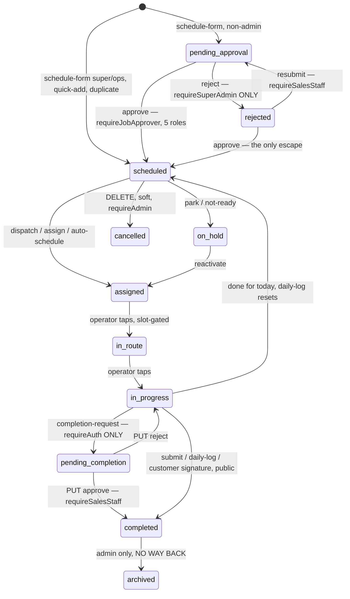
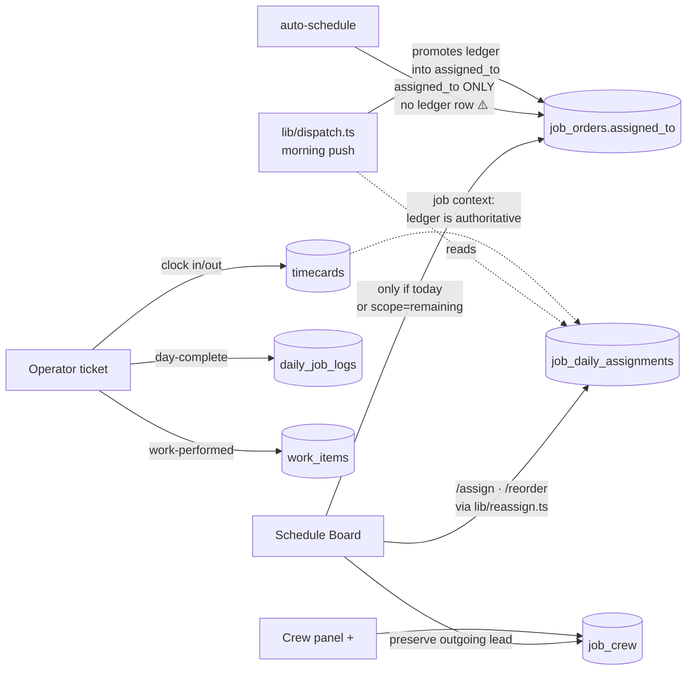
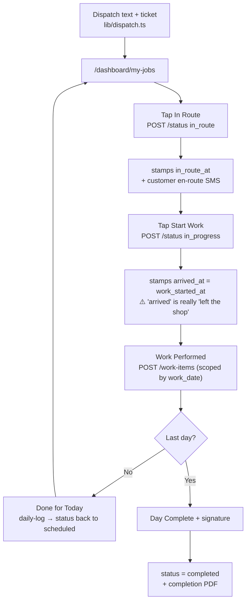
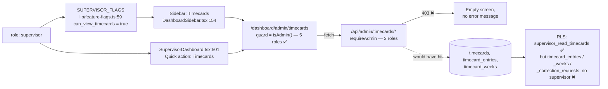

# SYSTEM MAP — the engineering + QA wiring diagram

> **This is not the sales deck.** `docs/plans/PLATFORM_WALKTHROUGH_DECK.md` is the story you tell a
> customer. This is the schematic you use when something doesn't work: what screens exist, what each
> one calls, which table it lands in, and **where the joins are weak**.
>
> Written Aug 15, 2026 against `main`. Every route path, role array and line number below was read out
> of the source or queried against the production database (`klatddoyncxidgqtcjnu`). Nothing here is
> inferred. Where a claim came from prod data it says so.
>
> **Scope:** the five areas the founder is walking on Monday — Timecards, Schedule Board, Jobs lists,
> Team Profiles, Supervisor. Other surfaces are named only where they collide with these.

---

## Table of contents

1. [How to read this](#1-how-to-read-this)
2. [The three defect shapes](#2-the-three-defect-shapes)
3. [Focus area 1 — Timecards](#3-focus-area-1--timecards)
4. [Focus area 2 — Schedule Board](#4-focus-area-2--schedule-board)
5. [Focus area 3 — Jobs: Active / Pending / Completed](#5-focus-area-3--jobs-active--pending--completed)
6. [Focus area 4 — Team Profiles](#6-focus-area-4--team-profiles)
7. [Focus area 5 — Supervisor](#7-focus-area-5--supervisor)
8. [**WEAK JOINS — ranked**](#8-weak-joins--ranked)
9. [Diagrams](#9-diagrams)
10. [**The Monday checklist**](#10-the-monday-checklist)
11. [Appendix — the three role vocabularies](#11-appendix--the-three-role-vocabularies)

---

## 1. How to read this

Three layers decide whether a click works. They are written in three different files, by three
different rules, and **they do not agree**:

| Layer | Where it lives | What it controls |
|---|---|---|
| **Page guard** | `useEffect` in the page's `page.tsx`, usually `getCurrentUser()` + a role array, sometimes `isAdmin()` from `lib/auth.ts` | Whether the screen renders at all |
| **API guard** | `require*()` from `lib/api-auth.ts` at the top of the route handler | Whether the data comes back |
| **RLS policy** | `pg_policies` in Postgres | Whether a *client-side* Supabase read returns rows (bypassed entirely when the server uses `supabaseAdmin`) |

A screen is only healthy when all three admit the same set of roles. Section 8 is the list of places
where they don't.

**Live roster (queried from prod, Aug 15):** 8 operators · 7 apprentices · 3 super_admin · 2
operations_manager (both named "Andres Altamirano") · 2 salesman (Adam Ingalls, Jeter Yates) · 1 admin
(Amanda McClelland) · 1 supervisor (David schadt — plus a second, inactive-looking "David" row).
That roster is what makes the rankings in section 8 what they are: **there is exactly one supervisor,
one admin and two salesmen, and every one of them hits a broken join in the first ten minutes.**

---

## 2. The three defect shapes

Everything in section 8 is one of these three. Learn the shapes and you can predict the next bug.

### Shape A — "the page admits a role the backend refuses"
`lib/auth.ts:117` `isAdmin()` returns true for **five** roles:
```ts
['admin', 'super_admin', 'operations_manager', 'supervisor', 'salesman']
```
`lib/api-auth.ts:41` `ADMIN_ROLES` — used by `requireAdmin`, which guards ~120 routes — is **three**:
```ts
['admin', 'super_admin', 'operations_manager']
```
And the SQL helper `public.is_admin()`, used inside RLS on 44 tables, is **two**:
```sql
role IN ('admin', 'super_admin')
```
Three definitions of the word "admin". A page guarded by the first, calling a route guarded by the
second, reading a table guarded by the third, fails in two different places for two different people.

### Shape B — "the board works per day, the code reads the job"
The schedule board writes crew into **`job_daily_assignments`** (one row per job per date). Much of the
platform still asks `job_orders.assigned_to` — a single column that can only hold one person for the
whole job. `lib/reassign.ts:419` always writes the ledger; `lib/reassign.ts:523` writes `assigned_to`
**only when the drop is for today or scope is `'remaining'`**. `lib/dispatch.ts:116-152` back-fills
`assigned_to` from the ledger on the morning of, which is why this is invisible most days and
catastrophic on the others (future-dated placements, helper-only days, mid-span operator swaps).

25 files read the ledger. 89 touch `assigned_to`. Section 8 names the ones inside the five focus areas.

### Shape C — "RLS names operations_manager and forgets supervisor"
The Aug 14 migration `20260814b_supervisor_can_see_what_his_dashboard_offers.sql` added
`supervisor_read_*` SELECT policies to **13** tables:

`job_orders · daily_job_logs · work_items · timecards · job_daily_assignments · job_crew ·
helper_work_logs · customers · customer_contacts · job_notes · vehicles · supervisor_visits ·
job_helper_reviews`

A live `pg_policies` query run for this document found **73 more tables** with a policy naming
`operations_manager` and no supervisor anywhere. That only matters where a page reads Supabase
**directly from the browser** rather than through an API — those sites are listed in section 8.

---

## 3. Focus area 1 — Timecards

### 3.1 Screens

| Route | Who can open it (page guard) | What it reads (API + tables) | Buttons → what they call | Known gaps |
|---|---|---|---|---|
| `/dashboard/admin/timecards`<br>`page.tsx:208` | `isAdmin()` = **admin, super_admin, operations_manager, supervisor, salesman** + flag `can_view_timecards` (`:217`) | `GET /api/admin/timecards/team-summary` (**`requireAdmin`**) · `GET /api/admin/timecards` (**`requireAdmin`**) · `GET /api/admin/timecards/correction-requests` · client-side `supabase.from('timecard_settings_v2')` (`:266`) | Approve All → `POST .../timecards/{id}/approve` (loop, one call per card) · Edit clock-in → `PATCH .../timecards/{id}` · No-show → `POST .../no-show` · Export PDF/CSV → `GET .../export?format=` · Manual entry → `POST .../manual` · row click → `/timecards/operator/{id}` | 🔴 **Supervisor + salesman open the page and every fetch 403s.** Week is hardcoded Mon→Sun (`:87-97`) — payroll is Sat→Fri. `:224` uses `toISOString().split('T')[0]`, the pattern `lib/dates.ts` bans. |
| `/dashboard/admin/timecards/corrections`<br>`page.tsx:76` | `['admin','super_admin','operations_manager']` | `GET/PATCH /api/admin/timecards/correction-requests[/id]` (`requireAdmin`) · `GET/POST .../remote-verify` | Approve/Reject correction (+ optional override of clock in/out) → `PATCH .../correction-requests/{id}` | Aligned. 409 on re-deciding a non-pending row. Self-approval **is** blocked here (`[id]/route.ts:115`). 68 correction rows in prod. |
| `/dashboard/admin/timecards/late`<br>`page.tsx:65` | `['admin','super_admin','operations_manager']` | `GET /api/admin/timecards/late` · `GET/PUT /api/admin/timecard-settings` · `GET/POST/DELETE .../day-overrides` | Edit grace minutes → `PUT /api/admin/timecard-settings` · Add/remove day override → `.../day-overrides` | Aligned. |
| `/dashboard/admin/timecards/operator/[id]`<br>`page.tsx:493` | `isAdmin()` — **same 5 roles** | 12 endpoints, **all `requireAdmin`** | Approve entry · Delete entry (reason required) · No-show · Approve/reject out-of-radius clock-out · **Approve week / Reject week** → `PATCH .../operator/{id}` · Save entry edit → `PATCH .../entries/{id}` (falls back to `PUT .../{id}/update` on 404) · Recalculate week · Per-operator PDF | 🔴 Same supervisor/salesman hole. `timecard_entries` has **0 rows in prod**, so the entry edit always takes the legacy fallback path. `timecard_weeks` has **0 rows** — the draft→submitted→approved week machine has never run. |
| `/dashboard/admin/timecards/operator/[id]/report`<br>`page.tsx:20` | `['admin','super_admin','operations_manager']` | `GET /api/admin/operator-report/{id}?year=` (`requireAdmin`) | read-only | Redirect at `:78` has **no `return`** — the component keeps rendering for one tick after bouncing an unauthorised user. |
| `/dashboard/admin/settings/timecard`<br>`page.tsx:150` | `['super_admin','operations_manager','admin']` | `GET/PUT /api/admin/timecard-settings` → `timecard_settings_v2` | Save settings | 🔴 **~11 of 25 controls on this page do not persist.** The PUT body (`:219-241`) and the column map (`timecard-settings/route.ts:105-118`) omit `weekStartDay`, `regularHoursPerDay`, `dailyOTThreshold`, `doubleTimeDaily/Weekly`, `otMultiplier`, `doubleTimeMultiplier`, `roundToNearest`, `requireAdminApproval`, `maxHoursPerDay`, `lockTimecardAfterDays`. They land in `localStorage` only (`:255`), so they look saved on the browser that set them and are gone everywhere else. |
| `/dashboard/timecard` (**employee's own**)<br>`page.tsx:183` | **any logged-in user** | `GET /api/timecard/current` · `.../history` · `GET /api/operator/pto-balance` (all `requireAuth`) | Clock out → `POST /api/timecard/clock-out` · Request correction → `POST /api/timecard/correction-request` · Download PDF → `GET /api/timecard/pdf?weekStart=` | Correct by accident — every read is self-scoped by `user_id`. Also Mon→Sun (`:45`). |
| Clock **in/out** (no dedicated page) | `app/dashboard/page.tsx:413/544` (operators) · `SupervisorDashboard.tsx:194/214` · `ShopManagerDashboard.tsx:119/154` · `ShopHelpDashboard.tsx:93/128` · `components/NFCClockIn.tsx` | `POST /api/timecard/clock-in` / `clock-out` (`requireAuth`) | GPS check → clock-in → writes `timecards`, reads `job_daily_assignments` for job context (`clock-in/route.ts:410`, marked AUTHORITATIVE) | Four separate copies of the clock widget. The job-context read **does** use the per-day ledger — this one is right. |

### 3.2 The payroll week — the single biggest finding in this area

**The founder's payroll week is Saturday → Friday. The software has no Saturday→Friday anywhere.**

- `lib/dates.ts:73-81` `mondayOf()` is the only week anchor in the codebase. Every week view, every
  `weekStart` parameter, every OT-over-40 bucket, the PDF and the CSV all derive from it.
- `app/dashboard/admin/timecards/page.tsx:87-97`, `app/dashboard/timecard/page.tsx:45`,
  `app/dashboard/admin/operator-profiles/page.tsx:171` each define their own private Monday helper.
- `app/api/admin/timecards/team-summary/route.ts:33` — `function getMondayFromString(weekStart)`.
- `app/api/admin/timecards/export/route.ts:8` — the docblock literally says *"Monday of the target week"*.
- The DB **has** the setting: `timecard_settings.week_start_day` with a
  `CHECK (... IN ('monday',…,'sunday'))` (`20260330_timecard_system_v2.sql:140`). A grep of `app/` and
  `lib/` for `week_start_day` returns **one hit — the migration itself.** Nothing reads it. The seven
  day-buttons on the settings page (`settings/timecard/page.tsx:620-636`) write to `localStorage`.
- The only place in the repo that knows the real rule is a **comment**: `lib/missing-ticket.ts:25`,
  *"Payroll runs Saturday through Friday."*

Consequence: a week's regular/overtime split is computed over Mon–Sun. Saturday and Sunday hours land
in the wrong pay week, and the 40-hour OT threshold is applied to the wrong seven days. Prod has
timecards on **all 7 days of the week** (verified), so this is not theoretical.

### 3.3 Approvals — four state machines, two of them dead

| State | Column / table | Values | Written by | Prod rows |
|---|---|---|---|---|
| Per-card approval | `timecards.approval_status` | `pending · auto_approved · manually_approved · rejected · flagged` | DB trigger `on_timecard_auto_approve` on clock-out; `no-show`, `manual`, `time-off/apply`, `holidays/apply` routes | 263 auto_approved · 20 flagged · 2 manually_approved |
| Per-card boolean | `timecards.is_approved` | true/false | `POST /api/admin/timecards/{id}/approve` | — |
| Week roll-up | `timecard_weeks.status` | `draft · submitted · approved · rejected` | only `PATCH /api/admin/timecards/operator/{id}` (`approve_week`/`reject_week`) | **0 rows** |
| Per-entry (v2) | `timecard_entries.status` | `pending · approved · rejected · auto_approved` | `PATCH /api/admin/timecards/entries/{id}` | **0 rows** |
| Correction requests | `timecard_correction_requests.status` | `pending · approved · rejected` | operator POST; admin PATCH | 68 rows |

**The trap:** `GET /api/admin/timecards?pending=true` filters on `approval_status = 'pending'`
(`route.ts:61`), but the Approve button writes `is_approved`. The two never converge, so the **sidebar
"Timecards" badge** (`DashboardSidebar.tsx:229`) and the bulk-approve preflight can both be wrong.
Nothing in prod currently sits at `approval_status = 'pending'`, which is why nobody has noticed.

**Self-approval** is blocked in 2 of 6 approval paths — `entries/[entryId]` and
`correction-requests/[id]`. It is **not** blocked in `[id]/approve`, `operator/[id]` approve_week,
`no-show`, or `manual`.

### 3.4 Lunch

One place deducts it: `app/api/timecard/clock-out/route.ts:315-388`. Resolution order (`:373-380`):
`profiles.default_lunch_minutes` → role default (shop roles 60 min, everyone else 30, `:357-368`) →
tenant `timecard_settings_v2.break_duration_minutes`. Fires when
`autoDeduct && totalHours > break_threshold_hours (default 6) && duration > 0`. Writes three columns:
`lunch_duration_minutes`, `break_minutes` (legacy duplicate), `auto_lunch_applied`. Admin override at
`entries/[entryId]/route.ts:63-75` (0–480 min) stamps `lunch_override_by/at/reason` and recomputes
`total_hours`.

### 3.5 Exports

Both live in `app/api/admin/timecards/export/route.ts` (`requireAdmin`, `renderToBuffer` from
`@react-pdf/renderer`).

- **PDF** reads the `timecards` table directly and runs `calculateWeekSummary` → shows Regular,
  Weekly OT, Mandatory OT, Double Time, Night Shift, Shop Hours, plus signature blocks.
  Branding via `lib/pdf-branding.ts` (tenant-scoped since Aug 1), times rendered in tenant TZ.
- **CSV** reads the view `timecards_with_users`. That view's actual columns (queried from prod) do
  **not** include `entry_type`, `regular_hours`, `overtime_hours`, `double_time_hours`, or
  `pay_type_override`. It does have `net_hours`, `gross_hours`, `lunch_duration_minutes`.
  **So the CSV structurally cannot show a Double Time day, an OT split, or a PTO/holiday entry type,
  while the PDF for the same week can.** Two exports of one week disagree.
- One more: `timecards_with_users` has `reloptions = NULL` in prod — it is **not**
  `security_invoker`. It carries `hourly_rate` and `labor_cost`. It currently has **no grant to
  `authenticated`**, so it is not reachable from the browser today. Do not grant it one.

---

## 4. Focus area 2 — Schedule Board

`app/dashboard/admin/schedule-board/page.tsx` is 2,506 lines and calls 30 endpoints.

### 4.1 Screens and controls

| Route / control | Who can open it | What it reads | Buttons → what they call | Known gaps |
|---|---|---|---|---|
| `/dashboard/admin/schedule-board`<br>`page.tsx:271` | `['admin','super_admin','salesman','operations_manager','supervisor']` + flag `can_view_schedule_board`. **`shop_manager` is excluded here but allowed by every API guard.** | `GET /api/admin/schedule-board?date=` (`requireScheduleBoardAccess`) → `schedule_board_view` + `job_daily_assignments` overlay + `job_crew` + `profiles` | see rows below | `canEdit` (`:74`) is computed client-side and ignores the server's own `meta.canEdit` (`route.ts:222`), which is dead code. |
| **Day view — slot rows** (`OperatorRow.tsx`) | as above | roster from `.../operators` | Drag a card onto a row (HTML5 DnD, `:257/:283`) → `POST /api/admin/schedule-board/assign` · operator/helper dropdown → same route · Mark Out · Time Off (`requireAdmin`) · Row note (`requireAdmin`) | 🔴 Time Off and Row Notes are rendered for anyone with `canEdit` but the routes are `requireAdmin`; `page.tsx:1686` swallows the failure with `catch { /* silent fail */ }`. |
| **Day view — operator-keyed mode** (`OperatorRowView.tsx` + dnd-kit) | as above | same | Drag → `PATCH /api/admin/schedule-board/reorder` | 🔴 **`/reorder` is `requireSuperAdmin`.** In this view mode drag is the *only* assignment path, so Amanda (admin) and both ops managers get "Move Failed" on every drag. |
| **Week view** (`WeeklyView.tsx`) | as above | `GET /api/admin/schedule-board?startDate=&endDate=` | day header → jump to day · "+" → add crew | 🔴 The week branch (`route.ts:57`) **does not apply the `job_daily_assignments` overlay** — that is gated on `if (date && ...)` at `:73`. Week view shows the job-level lead, day view shows the per-day one. **The same job can name two different operators on two tabs of the same screen.** Cards are `draggable` (`:89`) but there is no drop target — the drag is inert. |
| **Unassigned column** (`UnassignedSection.tsx`) | as above; only rendered in `slots` mode | server splits at `route.ts:203-210`: `is_will_call` → folder, else `assigned_to` → assigned, else unassigned | Assign Operator → `AssignOperatorModal` → `/assign` · Print Ticket → `/api/job-orders/{id}/dispatch-pdf` | 🔴 A **helper-only** day assignment (ledger has `helper_id`, no `operator_id`) leaves `assigned_to` null, so the job sits in **Unassigned** even though a helper is on it. `/assign` explicitly supports helper-only crews. |
| **Will Call folder** (`WillCallFolder.tsx`) | as above | `route.ts:120-127` — a *global* query, `.eq('is_will_call', true).neq('status','pending_approval')`, not date-filtered | "Schedule Now" → `PATCH /api/admin/job-orders/{id}` `{is_will_call:false, scheduled_date, assigned_to:null, status:'scheduled'}` · "Make Will Call" (edit panel) → same route, `{is_will_call:true, assigned_to:null,…}` | 🔴 Both handlers swallow failure: `catch { /* optimistic */ }` at `page.tsx:1795` and `:1813`. A 403 or 500 leaves the card visually moved and the database unchanged — it comes back on refresh. 🔴 Assigning a Will Call job clears the flag **in local state only** (`page.tsx:1272`); `/assign` never PATCHes the column, so the job stays in the folder. |
| **Edit panel** (`EditJobPanel.tsx`, 1,116 lines) | as above | `job-orders/{id}/full-detail`, `/notes`, `/documents`, `project-managers`, `customers/{id}/contacts`, `jobs/{id}/crew` | Save → `PATCH /api/admin/job-orders/{id}` (+ `POST /assign` with `scope:'remaining'` if crew changed) · Duplicate → `POST /api/admin/job-orders/{id}/duplicate` · Make Will Call · Remove From Schedule | Fields: dates, arrival time, equipment, operator, helper, description, PO, customer, location, address, estimated cost, jobsite conditions, salesman, project manager, contact. |
| **Job detail slide-over** (`JobDetailView.tsx`, 2,268 lines) | as above | `full-detail`, `notes`, `operators`, `pending-jobs/{id}/suggest-dates` | Save → **`PATCH /api/job-orders/{id}`** (a *different* route from the edit panel) · Reassign → `/assign` with scope `'remaining'` only if `is_multi_day` | Two panels, two save routes, two field filters. |
| **Duplicate** (`RowDuplicateButton.tsx` + edit panel) | `requireSalesStaff` | — | `POST /api/admin/job-orders/{id}/duplicate` | Copies via a **67-column allowlist** (`lib/duplicate-job-order.ts`) — plan not record. Lands on the day you're viewing, unassigned, `created_via:'duplicate'`. **Does not copy `job_daily_assignments`** (route `:126-128`, deliberate). Copies `job_crew` only when `copyCrew:true`, which the board never sends but the edit panel does. |
| **Pending queue** (`PendingQueueSidebar.tsx`) | as above | `route.ts:107-113`, global `status='pending_approval'` | Approve → `ApprovalModal` → `PATCH /api/admin/job-orders/{id}` · Missing Info → `POST .../missing-info` | 🔴 `/missing-info` and `/notify` are **`requireSuperAdmin`**. |
| **"Changes" button** (`ScheduleBoardHeader.tsx:90`) | as above | — | — | 🔴 **The button has no `onClick`. It renders a badge count and does nothing when clicked.** |
| `/dashboard/admin/schedule-form` (job creation)<br>`page.tsx:1069` | `isAdmin()` — 5 roles | 8-step wizard | Submit → `POST /api/admin/schedule-form` (`requireSalesStaff`) | Status on create (`route.ts:90-93`): super_admin/ops_manager → `'scheduled'`; **everyone else → `'pending_approval'`**. Writes `job_orders`, `job_scope_items`, `schedule_form_submissions`, `job_form_assignments`, `customers`. **Never writes `assigned_to` and never writes a ledger row** — an approved job always lands in Unassigned. |

### 4.2 Where an assignment actually goes

All assignment paths funnel through `applyReassignment()` in `lib/reassign.ts`:

1. **`job_daily_assignments` — always** (`:405-420`, upsert on `job_order_id,assignment_date`), plus
   `day_sequence` shuffling at `:394-397`.
2. **`job_orders.assigned_to` — only if** `scope === 'remaining'` **or** the assignment date is the
   tenant-local today (`:522-560`). Default scope is `'day'` (`assign/route.ts:66`).
3. **`job_crew` — only** to preserve an outgoing lead who already filed a log or work item (`:576-600`).

`lib/dispatch.ts:116-152` promotes today's ledger row into `assigned_to` every morning. **That is the
patch that makes shape B invisible on the day itself and leaves it broken for everything dated ahead.**

### 4.3 Will Call

It is a **boolean column**, `job_orders.is_will_call` — not a status, not a table. Exposed by
`schedule_board_view`. Written on create by `POST /api/admin/schedule-form:156` (the toggle at
`schedule-form/page.tsx:4239`) and by the board's PATCH. Consumes no capacity
(`week-capacity/route.ts:104` filters `is_will_call = false`). Printed as the arrival time on the paper
ticket (`jobs/[id]/print/page.tsx:237`).

### 4.4 Guard table for every board route

`requireScheduleBoardAccess` = `requireScheduleViewer` = **admin, super_admin, operations_manager,
supervisor, salesman, shop_manager**. Its own docblock (`lib/api-auth.ts:281-283`) says
*"NEVER use on POST/PATCH/DELETE."*

| Route | Method | Guard | Verdict |
|---|---|---|---|
| `schedule-board` | GET | `requireScheduleBoardAccess` | ok |
| `schedule-board/assign` | **POST** | `requireScheduleBoardAccess` | ⚠️ write behind the read-only guard |
| `schedule-board/dispatch` | **POST** | `requireScheduleBoardAccess` | ⚠️ write |
| `schedule-board/auto-dispatch` | **POST** | `requireScheduleBoardAccess` | ⚠️ write |
| `schedule-board/quick-add` | **POST** | `requireScheduleBoardAccess` | ⚠️ write |
| `schedule-board/scan-ticket` | **POST** | `requireScheduleBoardAccess` | ⚠️ write |
| `jobs/[id]/crew` | **POST/DELETE** | `requireScheduleBoardAccess` | ⚠️ write |
| `schedule-board/reorder` | PATCH | **`requireSuperAdmin`** | 🔴 too tight |
| `schedule-board/notify` | POST | **`requireSuperAdmin`** | 🔴 too tight |
| `schedule-board/missing-info` | POST | **`requireSuperAdmin`** | 🔴 too tight |
| `schedule-board/update-schedule` · `auto-schedule` · `row-notes` · `time-off` · `settings` PATCH | POST/PATCH/DELETE | `requireAdmin` | ok-ish; UI shows them to non-admins |
| `schedule-board/{operators,capacity,crew-grid,skill-match,week-capacity,week-snapshot,settings GET}` | GET | `requireScheduleBoardAccess` | ok |

**Net: `shop_manager` — a role the page deliberately blocks — can assign crew, dispatch tickets,
quick-add jobs and add/remove crew members over the API. And `admin` cannot drag a card in the
operator view.** Both directions of the same mistake, on the same screen.

### 4.5 Dead weight on this screen

`page.backup.tsx` (72 KB, April, still inside `app/`) · five components with **zero importers**
(`BatchPrintModal`, `JobPreviewPanel`, `SendBackModal`, `RejectFormModal`, `AddTimeOffModal` ≈ 906
lines) · `_components/constants.ts:14` hardcodes `SALESMEN = ['Andres A','Adam I','Jey Y','Doug R',
'David S']` instead of reading the roster · `week-capacity`/`week-snapshot` fall back to a **third**
crew table, `job_crew_assignments`, which `lib/reassign.ts` never writes.

---

## 5. Focus area 3 — Jobs: Active / Pending / Completed

### 5.1 Screens

| Route | Who can open it | What it reads | Buttons → what they call | Known gaps |
|---|---|---|---|---|
| `/dashboard/admin/active-jobs`<br>`page.tsx:164` | `['super_admin','operations_manager','admin','salesman','shop_manager','supervisor']` + flag `can_view_active_jobs` | `GET /api/admin/active-jobs` (`requireScheduleViewer`) · `GET /api/admin/jobs/{id}/summary` per job · `GET /api/job-orders/{id}/work-history` | All/Mine toggle · stat tiles (`all`/`today`/`coming_up`/`attention`) · Duplicate → `POST /api/admin/jobs/{id}/duplicate` · Delete → `DELETE /api/admin/jobs/{id}` (soft, sets `cancelled`) | 🔴 **Non-admins are force-scoped to `created_by = self`** (`route.ts:50`). Prod: David schadt has created **0** jobs → his Active Jobs page is empty. `coming_up` means *tomorrow only*. |
| `/dashboard/admin/pending-jobs`<br>`page.tsx:16` | `['super_admin','operations_manager','admin','salesman','shop_manager','inventory_manager','supervisor']` | `GET /api/admin/pending-jobs` (**`requireSalesStaff`** — no shop_manager, no inventory_manager) | Expand row · "Push up" → `POST /api/admin/pending-jobs/{id}/reactivate` | 🔴 shop_manager + inventory_manager pass the page guard and 403 at the API → permanently empty list, no error UI. Tenant filter is **conditional** (`route.ts:24`) so a super_admin sees every tenant's parked jobs. |
| `/dashboard/admin/completed-jobs`<br>`page.tsx:180` | `['admin','super_admin','salesman','operations_manager']` (role read from `profiles`, not localStorage — the strongest guard of the four) | **Direct client-side Supabase** — `job_orders`, `profiles`, `work_items`, `daily_job_logs`, `standby_logs`, `pdf_documents`. RLS is the only boundary. | Print work ticket → `/dashboard/admin/jobs/{id}/work-ticket?mode=week` · Labor modal → `GET /api/admin/job-pnl/{id}` · Download → `POST /api/admin/sign-urls` | 🔴 `standby_logs` and `pdf_documents` RLS both use `public.is_admin()` = **admin + super_admin only**. The page admits **salesman** and (via bypass) **operations_manager**, so for those two roles standby logs and saved PDFs come back **empty with no error**. |
| `/dashboard/admin/completed-job-tickets`<br>`page.tsx:66` | `['admin','super_admin','salesman','operations_manager']` — but the whole check sits inside `if (userStr)` reading `localStorage['patriot-user']`. **If that key is absent the guard silently does nothing and the page renders.** | Direct client Supabase, `status='completed'` | row → `/completed-job-tickets/{id}` | Same row set as Completed Jobs, different sort. Two pages, one query. |
| `/dashboard/admin/jobs/[id]` (detail)<br>`page.tsx:608` | `['admin','super_admin','operations_manager','salesman','supervisor']` | 10 endpoints incl. `jobs/{id}/summary` (`requireSalesStaff`), `/live-status`, `/helper-logs`, `supervisor-visits`, `job-orders/{id}/daily-log` | Approve completion → `PUT .../completion-request {approve}` · Reject → same `{reject}` · Edit timestamps → `PATCH .../timestamps` (`requireAdmin`) · Edit schedule → `PUT .../schedule` · **`<OfficeCloseJob>`** → `POST/DELETE .../office-complete` | Office close allows `['admin','super_admin','operations_manager','supervisor']` (`office-complete/route.ts:39`) — matches the founder's Aug 5 decision. |
| `/dashboard/admin/jobs` | — | — | — | 🔴 **404. There is no `page.tsx`** — only `[id]` sub-routes exist. |
| `/dashboard/admin/upcoming-projects` | **no guard at all** | **nothing — zero DB calls** | — | 🔴 940 lines of hardcoded mock data with a fabricated status `'confirmed'`. Its own header says *"DO NOT DEMO THIS PAGE, DO NOT LINK IT."* Reachable by typing the URL. |
| `/dashboard/admin/debug/active-jobs` | — | raw client Supabase | Buttons do `supabase.from('job_orders').update({status:'completed'})` and a **hard `.delete()`** | 🔴 Bypasses the soft-delete route, its audit log, and the FK reasoning. Do not open this page. |

### 5.2 Why a job appears — the exact filters

**Active Jobs** — `app/api/admin/active-jobs/route.ts:42-50`
```
tenant_id = auth.tenantId
AND status NOT IN ('completed','cancelled','archived','pending_approval','on_hold')
AND (caller ∈ {super_admin, operations_manager, admin} without ?mine=true
     OR created_by = caller)
```
So membership is `scheduled · assigned · in_route · on_site · in_progress · pending_completion ·
**rejected**`. There is no `deleted_at` filter — it is safe only because soft-delete also writes
`status='cancelled'`.

**Active Jobs dashboard card** — `active-jobs-summary/route.ts:33`
```
status IN ('assigned','in_route','on_site','in_progress')  LIMIT 20
```
The file's own comment says *"Keep this list in sync with active-jobs"* — it isn't. **`scheduled`,
`pending_completion` and `rejected` count on the page and not on the card.**

**Pending Jobs** — `pending-jobs/route.ts:22-24` → `status = 'on_hold'`, nothing else. Note the naming
trap: the page called "Pending Jobs" means **`on_hold`**, not `pending_approval`.

**Completed Jobs / Completed Job Tickets** — client-side, `status = 'completed'`, RLS only. Identical
sets, different sort (`work_completed_at` vs `completion_signed_at`).

### 5.3 The twelve statuses and where they go

DB `CHECK` (verified in prod): `pending_approval · scheduled · assigned · in_route · on_site ·
in_progress · on_hold · pending_completion · completed · cancelled · rejected · archived`.

Prod today: completed 14 · scheduled 11 · cancelled 6 · on_hold 4 · assigned 3 · in_progress 2 ·
pending_approval 1.

Orphans:
- **`rejected`** — written only by `POST /api/admin/job-orders/{id}/reject`. It **shows up in Active
  Jobs** (not in the exclusion list). And `LEGAL_TRANSITIONS` in
  `app/api/job-orders/[id]/status/route.ts:61-82` has **no `rejected` key**, so every transition out of
  it via that route returns *"Allowed next states: (none)"*. The only escape is the approve route.
  This is the exact bug that already bit a real operator on `on_hold` (documented at `:70-77`).
- **`archived`** — legal, admin-reachable from `completed`, read by **no list**, and
  `LEGAL_TRANSITIONS.archived = []`. Archiving a job removes it from every screen with no way back.
- **`on_site`** — accepted everywhere; **no UI ever posts it**. The flow goes `in_route → in_progress`.
- **`pending_approval`** — its only home is `/dashboard/admin/schedule-form-history`, and that feed
  hard-filters `created_via = 'schedule_form'`. A `pending_approval` job created any other way appears
  in zero lists.
- `lib/job-status.ts:19-29` types `JobStatus` as **10** values — missing `on_hold` and `rejected` — so
  `isValidTransition()` returns permissive `true` for every transition touching either.

### 5.4 Who can move each edge

| Edge | Route | Guard |
|---|---|---|
| `pending_approval`/`rejected` → `scheduled` | `POST /api/admin/job-orders/{id}/approve` | `requireJobApprover` = admin, super_admin, ops_manager, **supervisor, salesman** |
| any → `rejected` | `POST /api/admin/job-orders/{id}/reject` | 🔴 **`requireSuperAdmin`** |
| `rejected` → `pending_approval` | `POST .../resubmit` | `requireSalesStaff` |
| any → `on_hold` (park) | `POST /api/admin/pending-jobs/{id}/park` | `requireSalesStaff` |
| any → `on_hold` (site not ready) | `POST /api/job-orders/{id}/not-ready` | `requireAuth` + slot check |
| `on_hold` → `assigned`/`scheduled` | `POST .../reactivate` | `requireSalesStaff` |
| operator pipeline | `POST /api/job-orders/{id}/status` | inline: 3 admin roles **or** `assigned_to`/`helper_assigned_to` = you |
| `in_progress` → `pending_completion` | `POST /api/jobs/{id}/completion-request` | 🔴 **`requireAuth` only — any logged-in user, any job** |
| `pending_completion` → `completed`/`in_progress` | `PUT /api/admin/jobs/{id}/completion-request` | `requireSalesStaff` |
| any → `completed` (office close) | `POST /api/admin/jobs/{id}/office-complete` | admin, super_admin, ops_manager, **supervisor** |
| any → `completed` (operator submit) | `PUT /api/job-orders/{id}/submit` | `assigned_to` must be you; hardcodes `completed`, **skips `LEGAL_TRANSITIONS`** |
| any → `completed` (customer signs) | `app/api/public/signature/[token]/route.ts:242` | **public token route, no auth** |
| any → `cancelled` | `DELETE /api/admin/jobs/{id}` | `requireAdmin` |

**Six independent writers of `completed`, three of which bypass the transition table and the
early-finish 409 guard.**

---

## 6. Focus area 4 — Team Profiles

There are **three** overlapping team screens with three different guards, and `/dashboard/admin/team`
**404s** (only `team/invite` exists).

| Route | Who can open it | What it reads | Buttons → what they call | Known gaps |
|---|---|---|---|---|
| `/dashboard/admin/team-profiles`<br>`page.tsx:2534-2552` | `['super_admin','operations_manager','admin']`, **or** anyone whose `can_manage_team` flag is true | `GET /api/admin/users` — guard `['admin','super_admin','operations_manager']`, selects `hourly_rate` | Invite Member · Deactivate/Activate → `PATCH /api/admin/users/{id}` · Permanently Delete → `DELETE /api/admin/profiles/{id}` · Grant Super Admin → `requirePlatformOwner` · Save hire date → `PATCH /api/admin/profiles/{id}` | 🔴 The `can_manage_team` escape hatch is **dead** — anyone let through by the flag immediately 403s on `/api/admin/users` and lands in the error state. Role at `:2531` is read from `user.user_metadata.role`, i.e. the client-writable JWT blob. |
| `/dashboard/admin/team/invite`<br>`page.tsx:32` | `['admin','super_admin','operations_manager']` | `GET /api/admin/invite` · `GET /api/admin/access-requests` | Send/Resend/Revoke invite · Approve/Deny access request | Role dropdown comes from `getInvitableRoles()`, and `canInviteRole()` is re-checked server-side on both send and resend. **This is the one flow whose rank guard is correct.** |
| `/dashboard/admin/team-management`<br>`page.tsx:196` | `BYPASS_ROLES` = `['super_admin','operations_manager']` — strictest | `GET /api/access-requests/list` · `GET /api/admin/users` | Create User → `requireOpsManager` · Edit permissions → `PUT /api/admin/card-permissions` **then** `PATCH /api/admin/users/{id}` | — |
| `/dashboard/admin/operator-profiles`<br>`page.tsx:223` | `['admin','super_admin','operations_manager','**supervisor**']` | `GET /api/admin/profiles` (**`requireAdmin`**) · `.../operators/{id}/history` (**`requireSalesStaff`**) · `.../notes` · `.../skills` · `GET /api/admin/timecards?userId=` | Add Profile · Save note · **Save hourly rate → `PATCH /api/admin/operator-profiles/{id}`** · Timecard PDF · Add skill category | 🔴 Page admits supervisor; the list fetch is `requireAdmin` → **empty list**. But the *detail* route is `requireSalesStaff` and returns wages — see weak join #4. |

### 6.1 The tabs (verified names, `team-profiles/page.tsx:2058`)

`'info' | 'edit_info' | 'skills' | 'credentials' | 'badges' | 'permissions' | 'peer_ratings'` →
labelled **Profile Info · Edit Info · Skills · Credentials · Badges · Peer Ratings · Feature
Permissions**. **There is no Pay tab here** — pay is one `hourly_rate` field inside Edit Info
(`:670`). The Pay *tab* only exists on `/operator-profiles`.

| Tab | Shown when | Route | Storage | Real? |
|---|---|---|---|---|
| Profile Info | always | `PATCH /api/admin/profiles/{id}` (hire date only) | `profiles` | ✅ |
| Edit Info | caller ∈ super_admin/admin/ops_manager | `PATCH /api/admin/profiles/{id}` | `profiles` + `auth.users` on email change | ✅ |
| Skills | **target** is operator/apprentice | `GET/PUT /api/admin/team-profiles/{id}/skills` | `profiles.skill_levels` JSONB — **not a skills table** | ✅ |
| Credentials | target is operator/apprentice | `GET/PUT .../credentials` | six columns on `profiles` + free-form `certifications` JSON | ✅ |
| Badges | target is operator/apprentice | `GET/POST/DELETE .../badges` | `operator_badges` | ✅ but the POST route **never checks the target's role** — a badge can be written onto an admin or salesman via the API |
| Peer Ratings | management or own profile | `GET /api/ratings/received` | `rating_submissions` | read-only |
| Feature Permissions | target ≠ super_admin | `GET /api/admin/user-flags/{id}`; PATCH guard `['super_admin','operations_manager']` | `user_feature_flags` | ✅, `readOnly` unless super_admin |

Every tab gate keys on the **target's** role, never the caller's.

### 6.2 Skills exist twice

Two unreconciled systems for the same word:
- **Team Profiles** — a static TypeScript taxonomy (`lib/skills-taxonomy.ts`) written into
  `profiles.skill_levels` JSONB. **No admin UI to add a skill** — it needs a deploy.
- **Operator Profiles** — real tables `operator_skill_categories` + `operator_skill_ratings`, with a
  working "add category" UI (`SkillsTab.tsx:192`).

The same operator has two independent, non-communicating skill records. Badge types are a hardcoded
array (`team-profiles/page.tsx:1709`: `['GE','BMW','M3','OSHA 10','OSHA 30','Other']`); credential
types are unstructured free text.

### 6.3 Pay

Three writers, three guards:

| Field | Read via | Write via | Write guard |
|---|---|---|---|
| `profiles.hourly_rate` (Edit Info) | `GET /api/admin/users` | `PATCH /api/admin/profiles/{id}` | `ADMIN_ROLES` (3), `hourly_rate` in `adminOnlyFields`, validated 0–1000 |
| `profiles.hourly_rate` (Pay tab) | `GET /api/admin/operators/{id}/history` — **`requireSalesStaff` (5 roles)** | `PATCH /api/admin/operator-profiles/{id}` | 3 roles — supervisor excluded |
| `profiles.commission_rate_default` | direct client Supabase read | `PATCH /api/profile/commission-rate-default` | own route |

**Prod fact: `hourly_rate` is NULL on all 41 profiles.** Every labor-cost figure on the platform
honestly reads "rates not set" until the founder enters wages. That is also the only reason the read
asymmetry in weak join #4 has not leaked anything yet.

---

## 7. Focus area 5 — Supervisor

There is no `/dashboard/supervisor` route. `app/dashboard/admin/page.tsx:649` branches:
`if (user?.role === 'supervisor') return <SupervisorDashboard user={user} />`.

`app/dashboard/admin/_components/SupervisorDashboard.tsx` (583 lines) is **hardcoded JSX** — it never
reads `ROLE_PERMISSION_PRESETS`. Setting `timecards: 'none'` for supervisor in the admin UI changes
nothing on this screen.

Its own load: `/api/timecard/current` ✅ · `/api/timecard/history` ✅ ·
`/api/admin/supervisor-visits?limit=20` ✅ · `/api/admin/active-jobs-summary` ✅ (returns, but see below).

| Card / tile | line | → Route | Page guard | → API | API guard | Verdict |
|---|---|---|---|---|---|---|
| New Visit Report | 252 | `/admin/site-visits/new` | ✅ supervisor | `POST /api/admin/supervisor-visits` | ✅ | **works** |
| New Quote | 259 | `/admin/schedule-form` | ✅ `isAdmin()` | `POST /api/admin/schedule-form` | ✅ `requireSalesStaff` | **works** |
| My Hours This Week | 323 | — | — | `/api/timecard/history` | ✅ `requireAuth` | **works** |
| Visits This Week / Open Follow-ups / Recent Visits | 332/341/363 | `/admin/site-visits` | ✅ | `GET /api/admin/supervisor-visits` | ✅ | **works** |
| **Active Jobs tile + My Active Jobs list** | 350/429 | `/admin/active-jobs` | ✅ | `/api/admin/active-jobs` | ✅ `requireScheduleViewer` | 🔴 **returns 0 rows — force-scoped to `created_by = self`, and David has created no jobs** |
| Quick: Schedule | 495 | `/admin/schedule-board` | ✅ | board APIs | ✅ | **works** (read); drag in operator view 403s |
| **Quick: Timecards** | 501 | `/admin/timecards` | ✅ via `isAdmin()` | `team-summary`, `timecards` | 🔴 **`requireAdmin`** | 🔴 **page opens, every fetch 403s** |
| Open Operator View | 511 | `/dashboard/my-jobs` | ✅ `operator_view: 'submit'` | operator APIs | ✅ | **works** |
| Command Center | 514 | `/dashboard/command-center` | ✅ | ✅ | ✅ | **works** |
| Clock in / out widget | 194/214 | — | — | `/api/timecard/clock-in`/`out` | ✅ | **works** |

### The supervisor preset is mostly decorative

`lib/rbac.ts:463-478`:
```ts
supervisor: preset({
  schedule_form: 'submit', schedule_board: 'view', active_jobs: 'view',
  customer_profiles: 'view', completed_jobs: 'view', timecards: 'view',
  site_visits: 'submit', equipment: 'view', fleet: 'view',
  voice_checkout: 'submit', operator_view: 'submit',
}),
```
- **`active_jobs` is not an `ADMIN_CARDS` key.** `preset()` (`:430-442`) silently drops unknown keys
  with a dev-only `console.warn`, so `getCardPermission(null,'active_jobs','supervisor')` returns
  `'none'`. Same bug in the `shop_manager` preset.
- Exhaustive grep: `getCardPermission` is enforced at exactly **three** call sites platform-wide
  (`my-jobs/page.tsx:102`, `OperatorViewCard.tsx:30`, `schedule-board/dispatch/route.ts:34`), all for
  `operator_view`. Everything else is a permissions UI that writes rows nothing reads.

### What a supervisor can actually open (page guards, verified)

`/dashboard` · `/dashboard/admin` · `site-visits` + `/new` + `/[id]` · `active-jobs` ·
`pending-jobs` · `schedule-board` · `schedule-form` · `schedule-form-history` · `jobs/[id]` ·
`operator-profiles` · `equipment` + `[id]` · `fleet` + `[id]` · `equipment-by-operator` ·
`inventory-control` · `analytics` · **`timecards`** · `maintenance/new` · `command-center` ·
`my-jobs`. Sidebar additionally offers **My Timecard** and **Request Time Off**.

Every one of those guards runs off `getCurrentUser()` (localStorage) — they are UX only, never security.

---

## 8. WEAK JOINS — ranked

Ranked by **how likely the founder is to hit it while clicking**, given the real roster.

---

### 🔴 #1 — Timecards: the page lets supervisor and salesman in; every API call 403s

| | |
|---|---|
| **The page promises** | `app/dashboard/admin/timecards/page.tsx:208` calls `isAdmin()` → `lib/auth.ts:117` returns true for `supervisor` and `salesman`. `SUPERVISOR_FLAGS.can_view_timecards = true` (`lib/feature-flags.ts:64`) so the second gate passes too. `lib/rbac.ts:469` advertises `timecards: 'view'`. The **supervisor's own dashboard puts a Timecards button on it** (`SupervisorDashboard.tsx:501`). The sidebar shows the link to supervisor, salesman and inventory_manager (`DashboardSidebar.tsx:154` excludes only shop roles). |
| **The backend allows** | `app/api/admin/timecards/route.ts:23`, `team-summary/route.ts:64`, `export/route.ts:211`, `correction-requests/route.ts:22`, `late/route.ts:20`, `operator/[id]/route.ts:31` — **all `requireAdmin`** = `['admin','super_admin','operations_manager']` (`lib/api-auth.ts:41`). |
| **What the user sees** | The payroll screen renders — header, week picker, export buttons, the lot — and every row is blank forever. No error message. David (supervisor) and both salesmen get this. Same on `/timecards/operator/[id]`. |
| **Fix** | One of two: widen `requireAdmin` on the read-only timecard routes to a new `requireTimecardViewer`, **or** narrow `lib/auth.ts:117`. Do not just narrow the page — the supervisor was given `timecards: 'view'` on purpose. |

---

### 🔴 #2 — Active Jobs is empty for the supervisor, and it is his dashboard's own tile

| | |
|---|---|
| **The page promises** | `active-jobs/page.tsx:164` admits `supervisor`, `salesman`, `shop_manager`. `SUPERVISOR_FLAGS.can_view_active_jobs = true`. `SupervisorDashboard.tsx:350` puts an "Active Jobs" KPI tile on the supervisor's home screen and `:429` a "My Active Jobs" list. |
| **The backend allows** | `app/api/admin/active-jobs/route.ts:9,22,50` — `FULL_ADMIN_ROLES = ['super_admin','operations_manager','admin']`; every other role is **unconditionally** filtered to `created_by = auth.userId`. Identical logic in `active-jobs-summary/route.ts:26`. |
| **What the user sees** | Zero jobs. **Verified against production:** David schadt has created **0** job_orders. He can be dispatched onto a job, run its operator ticket, file a site visit on it — and his Active Jobs page stays empty. Both salesmen do see rows (Adam 7, Jeter 3) because they create their own jobs, so this reads as "works for sales, broken for supervisor". |
| **Fix** | The scoping predicate should be `created_by = me OR assigned_to = me OR helper_assigned_to = me OR I'm in job_crew OR I'm on today's job_daily_assignments` — the code comment at `:48-49` ("salesmen are not assigned to jobs as operators") was written before supervisors could be dispatched (Aug 9). |

---

### 🔴 #3 — Schedule Board: Amanda cannot drag, and the shop manager can dispatch

Two halves of the same guard mistake on the founder's most-used screen.

| | |
|---|---|
| **The page promises** | `schedule-board/page.tsx:271` admits `['admin','super_admin','salesman','operations_manager','supervisor']`. `canEdit` (`:74`) is true for `admin` outright. Every drag handle, dropdown, Time Off control and row note renders. |
| **The backend allows** | `schedule-board/reorder/route.ts:24`, `notify/route.ts:16`, `missing-info/route.ts:15` = **`requireSuperAdmin`**. `row-notes` and `time-off` = `requireAdmin`. |
| **What the user sees** | In `operators` board mode — where dnd-kit → `/reorder` is the *only* assignment path — **Amanda McClelland (the only `admin`) and both operations managers get "Move Failed" on every single drag** and the card snaps back. Approval notices and Missing-Info requests silently do nothing for them. Row notes fail into `catch { /* silent fail */ }` (`page.tsx:1686`) — no toast at all. |
| **The other half** | `requireScheduleBoardAccess` (= the **read-only** viewer set, including `shop_manager`) guards these **writes**: `POST /assign`, `POST /dispatch`, `POST /auto-dispatch`, `POST /quick-add`, `POST /scan-ticket`, `POST+DELETE /jobs/{id}/crew`, `PATCH /api/job-orders/{id}`. `lib/api-auth.ts:281-283` says in its own docblock *"NEVER use on POST/PATCH/DELETE."* A shop manager — blocked from the page — can dispatch tickets and change crews over the API. |
| **Fix** | Split the guard: a `requireScheduleEditor` (admin + ops + super + supervisor) for the writes, drop `requireSuperAdmin` on reorder/notify/missing-info, remove `shop_manager` from anything that isn't a GET. |

---

### 🔴 #4 — Wages are readable by supervisor and salesman; the UI only hides the tab

| | |
|---|---|
| **The page promises** | `operator-profiles/page.tsx:1121` renders the **Pay** tab only for `['super_admin','operations_manager','admin']`. Supervisor sees no Pay tab. |
| **The backend allows** | `app/api/admin/operators/[id]/history/route.ts:25` is **`requireSalesStaff`** = 5 roles including `supervisor` and `salesman`, and it returns `hourly_rate` (`:301`) **and the full `pay_history` array** — `regular_rate`, `overtime_rate`, `double_time_rate`, `reason`, `approved_by` (`:325`). The route's own docblock advertises supervisor and salesman as allowed. `GET /api/admin/operator-profiles` (`route.ts:53`) also admits supervisor and does `select('*')` on `profiles`. |
| **What the user sees** | Nothing — that is the point. There is no visible symptom; the data is simply on the wire for anyone who opens devtools or hits the URL. **Today this leaks nothing because `hourly_rate` is NULL on all 41 profiles.** The moment the founder enters wages (backlog item B2), it leaks every one. |
| **Related, already logged** | `profiles_select_all_authenticated` lets *every* authenticated user read every profile in the tenant, including `hourly_rate`, `commission_rate` and `date_of_birth`. Already in `BACKLOG.md` P1 — same root, bigger blast radius. |
| **Fix** | Before entering wages: narrow `operators/[id]/history` and `operator-profiles` GET to `ADMIN_ROLES`, or strip the pay fields from the payload for non-admin callers. |

---

### 🔴 #5 — Pending Jobs: approve works for five roles, reject works for one

| | |
|---|---|
| **The page promises** | The board's pending queue and `/dashboard/admin/pending-jobs` (`page.tsx:16`, seven roles) present approve and reject side by side. `requireJobApprover` was created on Aug 13 specifically so Adam (salesman) and David (supervisor) could release jobs — `lib/api-auth.ts:199-222`. |
| **The backend allows** | `POST /api/admin/job-orders/{id}/approve` → `requireJobApprover` (**5 roles**) ✅. `POST /api/admin/job-orders/{id}/reject` → **`requireSuperAdmin`** (`reject/route.ts:35`). Amanda, both ops managers, Adam and David can approve a job and **cannot reject one**. |
| **And it gets worse if you succeed** | `rejected` has **no key in `LEGAL_TRANSITIONS`** (`app/api/job-orders/[id]/status/route.ts:61-82`), so `allowedNext = []` and the job cannot be moved by the status route at all. Meanwhile it is **not** in the Active Jobs exclusion list (`active-jobs/route.ts:44`), so **a rejected job keeps showing in Active Jobs**. Its only proper home, `/schedule-form-history`, hard-filters `created_via='schedule_form'`. |
| **What the user sees** | "Forbidden. Super admin access required." on reject, from an admin. And any job that does get rejected is simultaneously stuck and still visible on the active list. |
| **Fix** | Reject should use `requireJobApprover`, symmetric with approve. Add `rejected: ['scheduled','pending_approval','cancelled']` to `LEGAL_TRANSITIONS` and add `'rejected'` to the Active Jobs exclusion list. |

---

### 🔴 #6 — Week view and day view of the same board name different operators

| | |
|---|---|
| **The page promises** | One Schedule Board with a Day/Week toggle. Week view is where the founder plans; day view is where he dispatches. |
| **The backend actually does** | `app/api/admin/schedule-board/route.ts:73` gates the `job_daily_assignments` overlay on `if (date && ...)`. The `startDate`/`endDate` branch (`:57`) returns raw `schedule_board_view` rows with no overlay. Day view resolves crew from the **per-day ledger**; week view shows **`job_orders.assigned_to`**, the job-level lead. |
| **What the user sees** | Place Zack on Thursday of a multi-day job that Dante leads. Day view for Thursday says Zack. Week view says Dante on every day including Thursday. Nothing errors. The founder plans the week off the wrong name. |
| **Two more instances of the same shape on this screen** | `crew-grid/route.ts:64,107-118` buckets by `assigned_to` per date and marks `!assigned_to` as unassigned — **it reports a booked operator as free** (already in BACKLOG). `skill-match/route.ts:84,92-93` builds its "who is busy" set from `assigned_to` and will **recommend an operator already placed that day via the ledger**. And `auto-schedule/route.ts:409-419` writes only `assigned_to` and **no ledger row**, the mirror image. |
| **Fix** | Apply the same overlay to the week branch — it is the same `job_daily_assignments` query already written 20 lines above — then repoint `crew-grid` and `skill-match` at it. |

---

### Runners-up (real, lower click-probability)

7. **Will Call and Remove-From-Schedule report success they never checked** —
   `page.tsx:1795` and `:1813` are `catch { /* optimistic */ }`. A 403 or 500 leaves the card visually
   moved and the DB unchanged; it reappears on refresh. Also, assigning a Will Call job clears the flag
   in **local state only** (`:1272`) — `/assign` never PATCHes `is_will_call`, so the job stays in the
   folder while also being on the board.
8. **Completed Jobs: standby logs and saved PDFs are invisible to salesman and ops manager** — the page
   reads `standby_logs` and `pdf_documents` **directly from the browser** (`completed-jobs/page.tsx:263,
   357`), and both tables' RLS uses `public.is_admin()` = **admin + super_admin only** (verified in
   prod). Salesman is in the page guard. Empty sections, no error.
9. **`PATCH /api/admin/users/{id}` has no rank check** — `app/api/admin/users/[id]/route.ts:88-100`
   caps only at `super_admin`. `ROLE_RANK` puts `admin` at 6 and `operations_manager` at 7, and
   `operations_manager` is in `BYPASS_ROLES` (full access to everything). **An admin can promote anyone,
   including themselves, to operations_manager.** It also accepts an arbitrary string as a role, which
   soft-bricks the account. The invite flow got `canInviteRole`; this one never did. Not reachable
   through the UI (that page is `BYPASS_ROLES`-gated) — reachable with a bearer token.
10. **`POST /api/jobs/{id}/completion-request` is `requireAuth` with no ownership check** — any
    authenticated user in the tenant can push **any** job to `pending_completion`, which removes it from
    operator work views. Compare `not-ready/route.ts:60-63`, which does check the slot.
11. **The timecard settings page saves ~11 of 25 controls to `localStorage` only** — including the
    week-start day, OT thresholds and multipliers. They look saved on the browser that set them.
12. **`/dashboard/admin/upcoming-projects` has no auth guard and no database** — 940 lines of mock data
    with a fake status. `/dashboard/admin/debug/active-jobs` does raw client-side hard `DELETE`s on
    `job_orders`. Neither is linked; both are reachable by URL.
13. **`archived` is a one-way trapdoor** — legal, admin-reachable from `completed`, read by no list,
    with `LEGAL_TRANSITIONS.archived = []`.
14. **`/dashboard/admin/jobs` 404s** and `/dashboard/admin/completed-job-tickets` skips its role check
    entirely when `localStorage['patriot-user']` is absent.

---

## 9. Diagrams

### 9.1 Job lifecycle — status, who moves it, what writes it


Red flags on this diagram: **`rejected` has no `LEGAL_TRANSITIONS` entry** (weak join #5), **reject is
super_admin-only while approve is 5 roles**, **`completion-request` needs only a login**, and
**`archived` is terminal and read by nothing**.

### 9.2 Who writes the six core tables



### 9.3 Operator ticket flow



### 9.4 Role → card → route → API → table, and where it snaps


Four layers — sidebar flag, page guard, API guard, RLS — and **only the first two agree**.

---

## 10. The Monday checklist

Tick these in order. The ones most likely to be broken are first. **Log in as each named person, not
as super_admin** — super_admin bypasses every guard in section 8 and will show you a working platform.

### Before you start
- [ ] Have four logins ready: **Amanda** (admin), **David schadt** (supervisor), **Adam Ingalls**
      (salesman), and one operator. Super_admin proves nothing.
- [ ] Open the browser console (F12) on every screen. Several failures in this list are **silent** —
      the only evidence is a red 403 line in the Network tab.

### A. Timecards — do these first, this is payroll
- [ ] **A1.** Log in as **David (supervisor)**. From his dashboard click the **Timecards** button.
      *Expect: the page opens and stays empty. That is weak join #1.* Confirm it is empty, not slow.
- [ ] **A2.** Same test as **Adam (salesman)**. Same expected result.
- [ ] **A3.** As **Amanda (admin)**, open Timecards. Confirm the week actually shows data.
- [ ] **A4.** **Look at the week the page shows you.** It will run **Monday to Sunday**. Your payroll
      week is **Saturday to Friday**. Confirm this with your own eyes — every hour total, every
      overtime calculation and both exports are bucketed on the wrong seven days.
- [ ] **A5.** Pick an employee who worked a **Saturday**. Check which week that Saturday's hours are
      counted in. Then check whether the 40-hour overtime line moves when you change weeks.
- [ ] **A6.** Click **Export CSV**, then **Export PDF**, for the same week. Open both.
      *Expect: the PDF shows Double Time / OT / Night Shift breakdowns and the CSV does not.*
      Note any number that differs between the two.
- [ ] **A7.** Approve one timecard. Then reload the page. Does it still show as needing approval?
      (Two different columns record approval; the badge counts one and the button writes the other.)
- [ ] **A8.** Go to **Corrections**. Approve one and reject one. Both should work and both should tell
      the operator.
- [ ] **A9.** Go to **Settings → Timecard**. Change the **week start day**, the OT threshold, and the
      max hours per day. **Save. Then reload the page in a different browser or an incognito window.**
      *Expect: your changes are gone.* Those controls only write to the browser you used.
- [ ] **A10.** Have an operator clock in and out with more than 6 hours. Confirm the lunch deduction
      appears and matches what you expect (30 min for field, 60 for shop).

### B. Schedule Board
- [ ] **B1.** As **Amanda (admin)**, switch the board to the **operator-keyed view** and **drag a job
      card onto another operator**. *Expect: "Move Failed" and the card snaps back.* Weak join #3.
- [ ] **B2.** As Amanda, try **Send Approval Notice** and **Request Missing Info** on a pending job.
      *Expect: nothing happens (super_admin only).*
- [ ] **B3.** As Amanda, add a **row note** and a **time-off entry** on the board. *Expect: silent
      failure — no error, no saved note.*
- [ ] **B4.** Click the **"Changes"** button in the board header. *Expect: nothing at all — it has no
      click handler.*
- [ ] **B5.** **The important one.** Take a multi-day job. In **Day view**, assign a *different*
      operator to one day in the middle. Now switch to **Week view** and look at that same day.
      *Expect: two different names.* Weak join #6.
- [ ] **B6.** Assign a job to a **helper only** (no operator). Look at the Unassigned column.
      *Expect: the job is still sitting in Unassigned.*
- [ ] **B7.** **Make Will Call** on a job, then **hard-refresh the page**. Is it still in the Will Call
      folder? Then **Schedule Now** it and refresh again. (Both handlers ignore failures.)
- [ ] **B8.** Assign an operator to a job that is in the Will Call folder. Refresh. *Expect: it is on
      the board **and** still in the folder.*
- [ ] **B9.** **Duplicate** a job. Confirm the copy lands on the day you are viewing, unassigned, with
      no progress, no signature and no work log carried over.
- [ ] **B10.** Open the **Crew Grid** view. Cross-check one operator who you know is booked on a
      multi-day job. *Expect: the grid may show him free.*
- [ ] **B11.** Use **AI Schedule** on an unassigned job, then check whether that assignment shows in
      Day view. (Auto-schedule writes the job-level lead and no per-day row.)

### C. Jobs — Active / Pending / Completed
- [ ] **C1.** Log in as **David (supervisor)** and open **Active Jobs**. *Expect: completely empty,
      even if he is dispatched on a job today.* Weak join #2. Verified in prod: he has created 0 jobs.
- [ ] **C2.** Compare the **"Active Jobs" number on the dashboard card** with the **count on the Active
      Jobs page**. *Expect: they differ* — the card omits `scheduled` and `pending_completion` and caps
      at 20.
- [ ] **C3.** As **Amanda (admin)**, open a pending job and press **Reject**.
      *Expect: "Forbidden. Super admin access required."* Then press **Approve** — that works.
      Weak join #5.
- [ ] **C4.** If any job is already in `rejected`, look for it in **Active Jobs**. *Expect: it is there,
      where it does not belong.* Then try to move it anywhere from the operator side.
- [ ] **C5.** Log in as **shop manager** (if you have one) or **inventory manager** and open **Pending
      Jobs**. *Expect: the page loads with an empty list forever.*
- [ ] **C6.** As **Adam (salesman)**, open **Completed Jobs**, pick a job that had standby time, and
      look for the **standby log** and any **saved PDF**. *Expect: both sections empty.* Then check the
      same job as Amanda — they should appear.
- [ ] **C7.** Park a job (**on_hold**), confirm it leaves Active Jobs and appears in Pending Jobs, then
      **reactivate** it and confirm it comes back.
- [ ] **C8.** Do **not** navigate to `/dashboard/admin/upcoming-projects` or
      `/dashboard/admin/debug/active-jobs`. The first is fake data; the second deletes rows for real.
- [ ] **C9.** Confirm `/dashboard/admin/jobs` 404s (it has no page) — make sure nothing links to it.

### D. Team Profiles
- [ ] **D1.** As **Amanda (admin)**, open Team Profiles → pick an operator → **Edit Info** → enter an
      **hourly rate** → Save → reload. Confirm it stuck. *(Prod: 0 of 41 profiles have a rate — until
      you do this, every labor-cost figure on the platform honestly reads "rates not set".)*
- [ ] **D2.** **Before you enter more than one rate**, decide about weak join #4: a **supervisor and a
      salesman can read every wage over the API** even though the Pay tab is hidden from them.
- [ ] **D3.** Walk each tab on one operator: **Profile Info, Edit Info, Skills, Credentials, Badges,
      Peer Ratings, Feature Permissions**. Save something in each, reload, confirm it persisted.
- [ ] **D4.** Note that **Skills exist in two unconnected places** — the Skills tab here writes a JSON
      blob on the profile; `/dashboard/admin/operator-profiles` → Skills writes real skill tables. Decide
      which one you want to be real.
- [ ] **D5.** Confirm `/dashboard/admin/team` 404s, and that nothing in the app links to it.
- [ ] **D6.** As **David (supervisor)**, open `/dashboard/admin/operator-profiles`. *Expect: empty list*
      (the list route is admin-only) even though the page opens.

### E. Supervisor
- [ ] **E1.** Log in as **David** and work down his dashboard tile by tile. From section 7, expect these
      to work: New Visit Report, New Quote, My Hours, Visits This Week, Open Follow-ups, Recent Visits,
      Schedule (read), Open Operator View, Command Center, clock in/out.
- [ ] **E2.** Expect these two to fail: **Timecards** (blank) and **Active Jobs** (empty).
- [ ] **E3.** As David, open the **Schedule Board** and confirm he can read it. Then try to change
      something and note what happens.
- [ ] **E4.** As David, open a job and use **Mark complete (office)**. That one is supposed to work for
      supervisors — confirm it does.
- [ ] **E5.** As David, use **Open Operator View** → run through a real ticket → confirm the way back
      ("Back to management") works.
- [ ] **E6.** Fix the data: there are **two profiles named "David"** and **two named exactly "Andres
      Altamirano"**. The schedule board resolves crew by name, so a duplicate name can silently dispatch
      to the wrong account. Deactivate or rename the extras.

### F. Anything you find
- [ ] Write it straight into `BACKLOG.md` with the screen, the role you were logged in as, and what you
      expected. The role is the part everyone forgets, and in this codebase it is usually the answer.

---

## 11. Appendix — the three role vocabularies

Keep this next to you while testing. Most of section 8 is one of these three lists disagreeing with
another.

**Client-side, `lib/auth.ts:117` — `isAdmin()`** — decides whether a *page* renders:
```
admin · super_admin · operations_manager · supervisor · salesman
```

**Server-side, `lib/api-auth.ts`** — decides whether *data* comes back:
| Guard | Roles |
|---|---|
| `requireAdmin` / `ADMIN_ROLES` | admin · super_admin · operations_manager |
| `requireSalesStaff` / `SALES_STAFF_ROLES` | + supervisor · salesman |
| `requireScheduleViewer` / `requireScheduleBoardAccess` | + shop_manager |
| `requireJobApprover` | admin · super_admin · operations_manager · supervisor · salesman |
| `requireOpsManager` | super_admin · operations_manager |
| `requireSuperAdmin` | super_admin |
| `requirePlatformOwner` | super_admin **and** tenant = Pontifex |
| `requireAuth` | anyone with a valid token and a tenant |

**Database, RLS** — decides whether a *client-side Supabase read* returns rows:
| Helper | Roles |
|---|---|
| `public.is_admin()` | **admin · super_admin only** |
| `public.current_user_has_role(...)` | whatever the policy lists — usually admin, super_admin, operations_manager |
| `supervisor_read_*` (Aug 14) | supervisor, on **13** tables only |

**Rule of thumb when something is empty and there is no error:** check which of these three lists the
role you are logged in as is missing from. It is almost always that.

---

*Written by reading the source and querying production. Corrections belong in this file — it is meant
to stay true, not to be an archive.*
